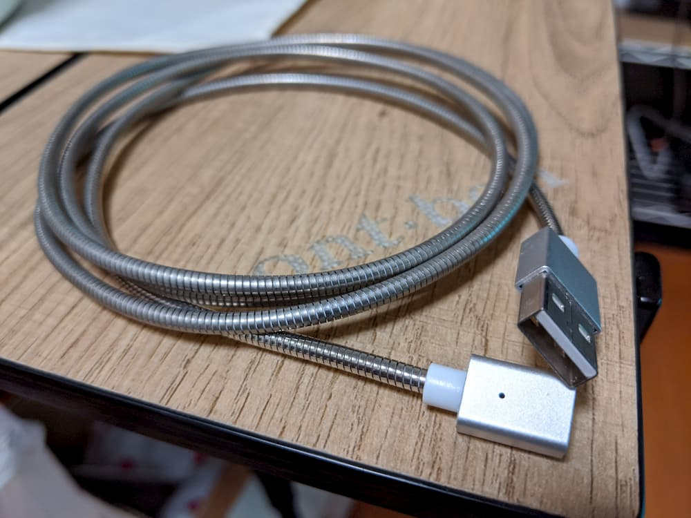
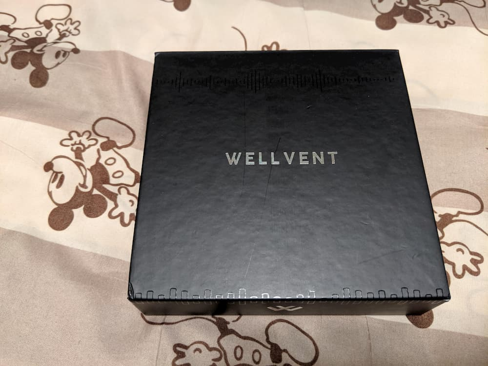
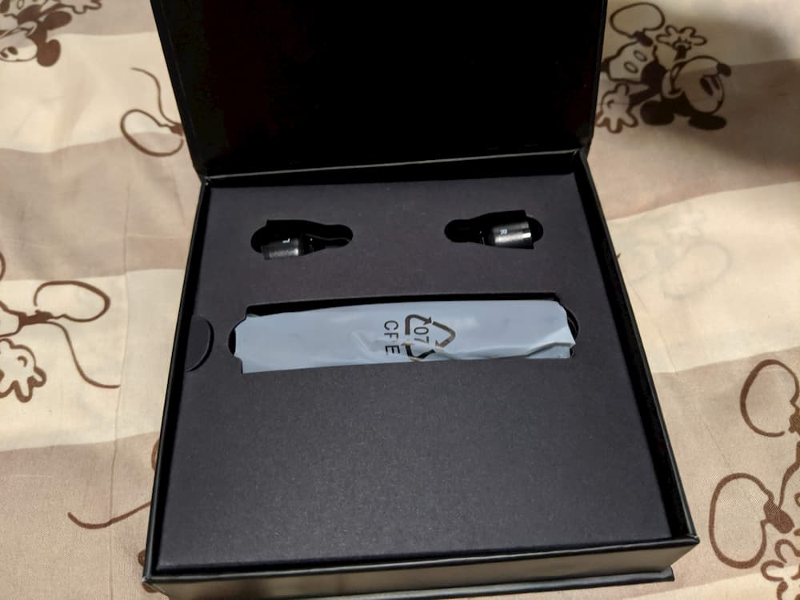
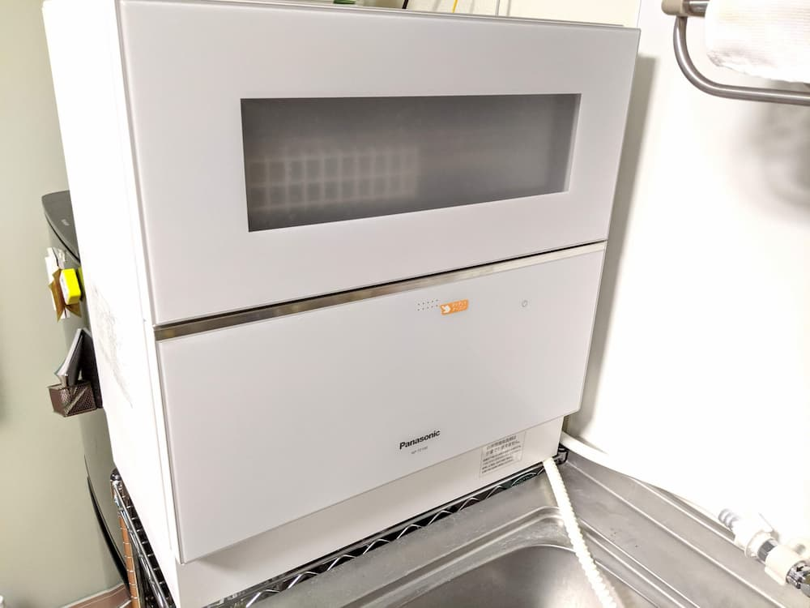

2019年も残りあと僅かですね。  
去年と同様に、今年買ってよかったものを5つ紹介したいと思います。  

# pCloud 生涯プラン

[pCloud](https://www.pcloud.com/)はDropboxのようなクラウドストレージです。  
サブスクリプションプランの他に買い切りのLIFETIMEプランが用意されており、その2TBのプランと[pCloud Crypto](https://www.pcloud.com/encrypted-cloud-storage.html)という追加オプションを一緒に購入しました。  

リカバリーコードのようなファイルはCryptoオプションで暗号化したフォルダに、写真や動画ファイルは通常のpCloudのフォルダに保存してます。  

定期的にセールで安くなっているので、そのタイミングで購入するとよいと思います。  

# マグネット式充電ケーブル

我が家の端末もいつの間にか色々な端子のものが増えていました。  
それに伴い、ケーブルも各端子のものが増えてました。  
micro USB, Type-C, ライトニングなど、充電の際、端子に合わせてケーブルを替えるのが煩わしいですね。  

そんなときに、[EVERCABLE](https://www.makuake.com/project/anchor-cable/)というクラウドファンディングのプロジェクトが始まっていたので、支援して入手しました。  

マグネット式便利ですね。ケーブルを差しっぱなしでいいなんて！  

ちなみに、最近[改良版のクラウドファンディング](https://www.makuake.com/project/blisslead/)が始まったようです。  

# マルチフォールディングテーブル

mont-bellの[マルチフォールディングテーブル](https://webshop.montbell.jp/goods/disp.php?product_id=1122635)を買いました。  



ソファの高さに合ったテーブルが欲しいと思ってたところ、マルチフォールディングテーブルの情報を得たので買ってしまいました。  

なんと言っても、高さが3段階に変えられるのがいいですね。  
状況に合わせて変えています。  

キャンプに持っていけるのもいいです。  

欠点はテーブルの上で文字を書く用途には向かない点。少し揺れるんですよね。  

# ワイヤレスイヤホン

今年は無くても困らないが、あった方が便利なものをクラウドファンディングでゲットしています。  

ワイヤレスイヤホンもその1つです。  
昨年買ったワイヤレスイヤホンが壊れたときに、ちょうどよくやっていたプロジェクトに支援してゲットしました。  

私が支援したのは[WELLVENT](https://www.makuake.com/project/wellvent/)というワイヤレスイヤホンです。  
前使っていたのはネックバンドタイプだったので、完全なワイヤレスイヤホンは初めてだったのですが、一度慣れてしまうとネックバンドタイプには戻れないですね。  

他のワイヤレスイヤホンを使ったことがないので、WELLVENTを他の製品と比較できないのですが、満足しています。  

ワイヤレスイヤホンのプロジェクトはクラウドファンディングサイトでよく見かけますね。  

# 食洗機

昨年のドラム式洗濯機に引き続き、QOL爆上げ施策第2弾。食洗機です。  

最新モデルが出たタイミングで旧モデルを買いました。  
とても便利ですね！  

ただ、食洗機に対応していない食器の存在が際立つようになりました。  
炊飯器の釜が食洗機に対応していないのが残念です。  

対応している製品あるのかな。  

## おわりに

2019年に買ってよかったと思うものを5つに絞って紹介しました。  
クラウドファンディングサイトを眺めていると、どれも欲しくなってしまいます。  

今年はこれが最後のブログ更新となりそうです。来年はもっと更新頻度をあげたいなと思います。  

