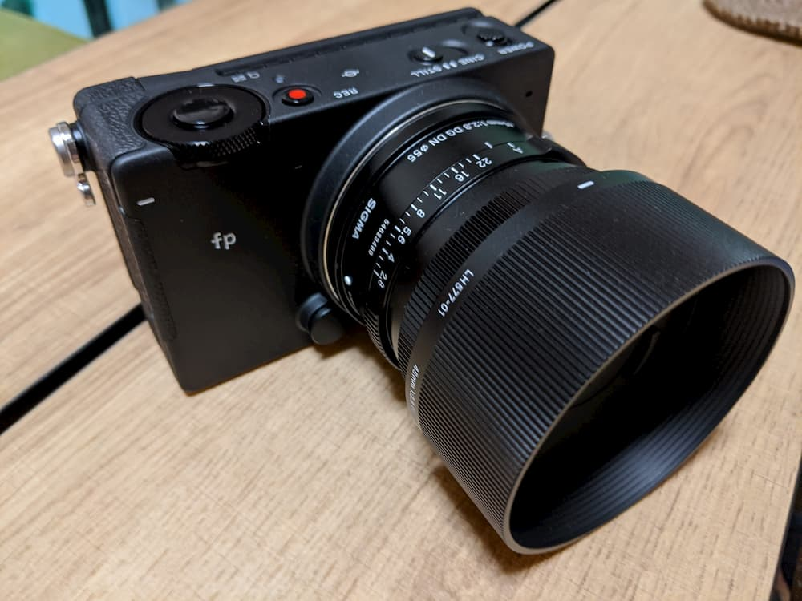

今年も年の瀬がやってきました。
振り返ると、今年は前年までと比べてブログを多く書くことができた気がします。  
今年の後半は生活環境が変わったこともあり、バタバタしていてブログの更新が滞っていましたが。  
今年も最後に買ってよかったものを紹介したいと思います。  

## GaN採用充電器

GaNは窒化ガリウムのことであり、これによって高出力の充電器を従来よりも小さく作ることが可能になったようです。  
私はクラウドファンディングサイトのMakuakeで[LilNob](https://www.makuake.com/project/lilnob/)という製品を買ったのですが、これが最高でした。  
USB Type-Cを2ポート、 USB Type-Aを1ポートを有しており、これさえあれば私が普段使用しているデバイス (ノートPC、スマートフォン、iPad) を一度にすべて充電できるのです。  
何個も充電アダプタを持ち歩く生活には戻れなくなりました。  



## SimpleLoginのサブスクリプション

無形ですがとても満足しているので紹介します。サービスごとに異なるメールアドレスを使いたいということについて、[以前ブログに書きました]()。
その後、ブログ内で紹介した[SimpleLogin](https://simplelogin.io/)のサブスクリプションを購入し、利用しています。  

  

上記の画像はSimpleLoginのダッシュボードの一部です。
新規登録の際にSimpleLoginでメールアドレス（サービス内ではエイリアスと呼びます）を作成することはもちろん、少しずつ既存の登録情報もSimpleLoginで作成したエイリアスに変更しており、現在までに作成したエイリアスは78個です。  
エイリアス宛のメールはSimpleLoginに紐づけているメールアドレス（ここではメインアドレスと呼ぶこととします）にフォワードされるのですが、不要なメールが届くエイリアスは無効化してしまえば、そのエイリアス宛のメールはメインアドレスに届かなくなります。  
もしサービスに登録したメールアドレスが漏れてしまい、スパムメールが届くようになったとしても、登録しているメールアドレスがSimpleLoginのエイリアスであれば、そのエイリアスを無効化することで、スパムメールがメインアドレスに届くことを防げます。  

これは私にとってすごく価値のあることなので、サブスクリプションの購入には少しも躊躇がありませんでした。  

## SIGMA fp

一眼レフカメラがほしいな、という思いをぼんやり抱いていたころに、SIGMA fpの発売予告を知らせるニュースを読み、そのコンセプトに一目惚れしました。
とはいえ、これまで一眼レフカメラを使ったことがなかったことと、高い買い物になることから、躊躇して発売直後には買わなかったんですよね。  

結局今年に入ってからも変わらず欲しい気持ちがあったので、買ってしまいました。  



いやーコンパクトでかっこいい。  

写真の撮り方や現像の仕方は少しずつ覚えていきたいと思います。  

## ミニマムな財布とコインケース

[2018年のエントリ]()でMicro Walletを紹介しているように、財布の小型化を進めています。今年からレジ袋が有料になったことを受けて、エコバッグが入る[MUZOSA](https://muzosa.jp/)というカードケースを買いました（写真左上）。  

こちらもMakuakeで購入しました。  
私はよく使うカードをマネークリップ（写真下）に挟んで、このカードケースにエコバッグとともに入れています。  

基本的にキャッシュレスな決済手段で買い物をしますが、現金しか使えないところのために現金も持ち歩くことがあります。
そのためにミニマムなコインケース（写真右上）を買いました。  
MUZOSA（マネークリップ入り）、Micro Wallet、コインケースをすべて持つと、長財布1つ持つのと大差がないように感じるかもしれませんが、私は一つ一つが小さいことはメリットと考えています。ポケットに入れておくのは使用頻度が高いものだけで良いですし。

## Nature Remo Mini

  

リモコンを登録すればスマホから操作できる点が良いです。
家の中でもスマホはたいてい持ち歩いているので、テレビのチャンネル替えたいなー、などとふと思い立ったときにスマホからすぐに実行できます。  
リモコンは必要なときに近くにないですからね。  

## おわりに

2020年に買ってよかったものを5つ紹介しました。
このシリーズも今年で3年目になりましたが、我ながらよく続いているなと感心しています。  

来年は今年以上に更新頻度高めにしたいです。
