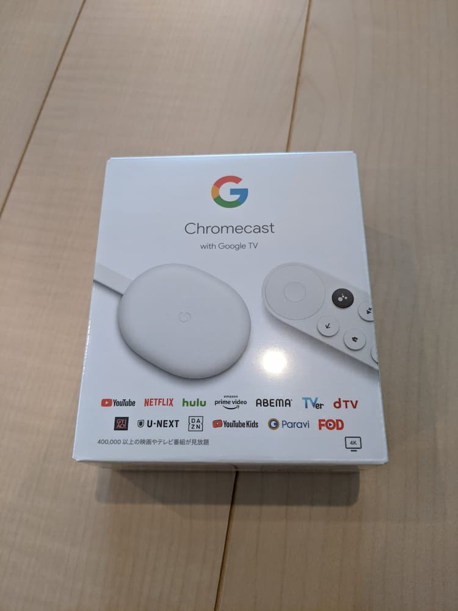
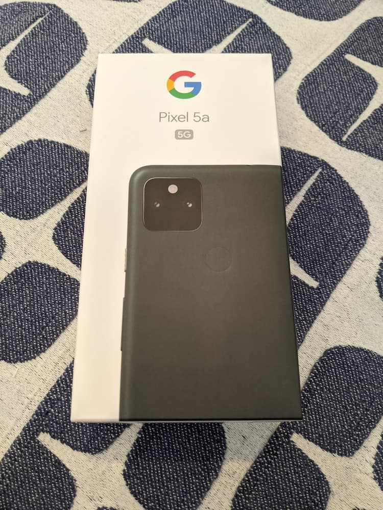
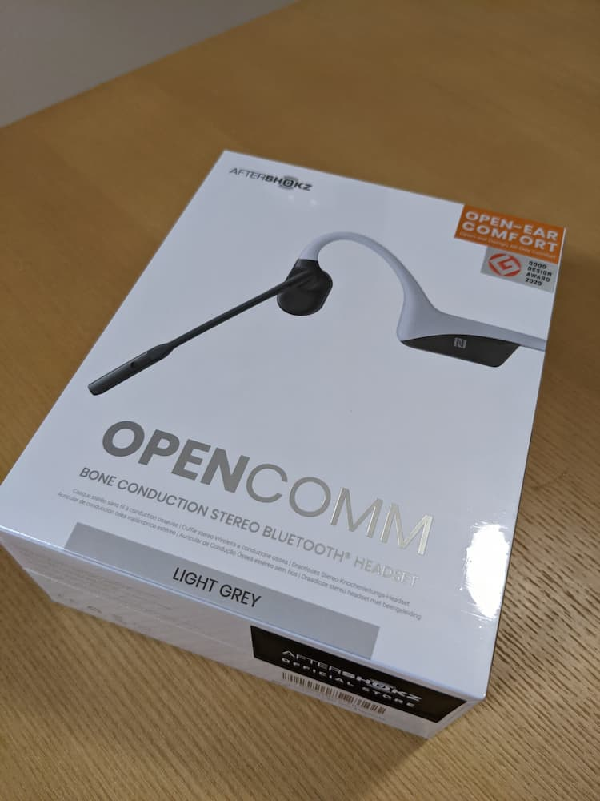

2021年の締めくくりとして、今年買ってよかったものを紹介します。  
今年はあまり買い物をしていない気がしていたのですが、例年紹介している数と同じ5つを挙げることができました。
自覚している以上に買い物してるってことですかね。
  
## ZEN PIT

コンパクトで軽量ながら、薪をそのまま置けます[^1]。
既に持っていた焚き火台は薪を半分にする必要があったので、とても快適です。  

[^1]: 以前ブログにかきました。 [ZEN PITを買った - blog.bridgey.dev ](  )

薪をそのまま置けるような大きめの焚き火台は重いものが多いのですが、ZEN PITは700gと比較的軽量な点が購入の決め手でした。

（知ってから1年以上購入を迷ってました。）

そろそろ焚き火をしたいです。

## Chromecast with Google  TV

初代Chromecastから買い替えました。
リモコンが付いて、さらにChromecastからアプリを起動できるようになり、格段に便利になりました。

主に、作業用BGMの再生、子どもが好きな動画の再生、LAN内のメディアサーバに置いている子どもを撮影した動画の再生などの用途で使っています。

予想の数倍QOLが上がりました。

## Google Nest Hub (第2世代)

コストコのセールで買いました。  

これまでスマートスピーカーに対して「それほど便利じゃないだろう」と思っていたのですが、1台あるととても便利でした。  
手が離せないときに音声でChromecastで再生している動画を止めたり、タイマーを設定したりできる体験が素晴らしいです。  

マイクをオフにする物理スイッチが付いてるところもポイント高いです。

IFTTTでGoogleアシスタントとTrelloを連携させ、Nest Hubに音声コマンドを話せばTrelloの買い物リストに追加できるようにしています。  
なくなったものや思いついたものをすぐNest Hubに話しかけることで、買い忘れることが減りました。  
この買い物リストは家族と共有しています。  

自分用のメモも音声コマンドから追加できるようにしており、欲しい物ややりたいことが浮かんだらすぐ登録しています。

Googleフォトの子どものアルバムをフォトフレームに設定しているので、待機時は子どもの写真が表示されています。

## Pixel 5a

元々au回線をガラホ、mineo回線をPixel 3aの2回線・2台持ちだったのですが、今年に楽天モバイル回線を開設して3回線となりました。  
Pixel 5aを購入した理由は、3台持ちを避けるためです。  
楽天モバイルを契約していなければ、Pixel 3aをもう1年使っていたと思います。

楽天モバイル (eSIM) 、mineo (物理SIM) のデュアルSIMでPixel 5aを使っています。

Pixel 3aよりも大きく重いですが、性能や使い勝手には満足しています。

Pixel 5aにはGoogleフォトのアップロード無制限特典が付いていないので、Pixel 3aをGoogleフォトへ写真をアップロードする端末として残してあります。

5a→3aの写真転送には[Syncthing](https://syncthing.net/)を利用しています。

## Open COMM

骨伝導ヘッドセットです。  
骨伝導イヤホンを紹介しているブログを見て骨伝導式に興味を持ち、オンライン会議にも使いたいのでイヤホンではなくヘッドセットを買いました。  

周りの音も変わらずに聞こえるというのは新しい体験で面白かったです。
マイクの品質も高く、オンライン会議でも問題なく使えます。

耳元のボタンを2秒押すことで接続しているスマートフォンの音声アシスタントを呼び出せます。  
Nest Hubのところで書いた音声コマンドとの相性がよく、Nest Hubがない部屋で家事をしているときでもすぐメモを残せるのは便利です。

注意点として、骨伝導式なので静かな空間だと周りに音が聞こえてしまいます。  
ほぼ無音の部屋で使っていると、家族から音漏れしていると言われます。

## おわりに

ZEN PITは然るべき場所に行く必要があるので使用頻度が低いですが、他の4つはほぼ毎日使っています。  
欲しいけどまだ購入を迷っているものもいくつかあり、もしかしたらそれらを来年の買ってよかったもので紹介するかもしれません。

特に購入を迷っているのはiPad mini 6です。
