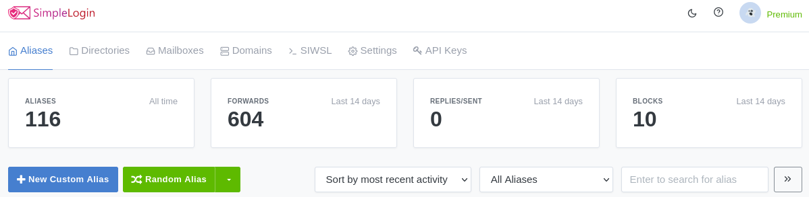

[SimpleLogin](https://simplelogin.io/)を使い始めて約1年が経ちました。  
SimpleLoginは、簡単に言うと、メインのメールアドレスに紐づく別のメールアドレスを生成するサービスです。この生成したメールアドレスをSimpleLoginではエイリアスと呼びます。  
生成したエイリアスをWebサービスに登録することで、メインのメールアドレスを隠すことができ、フィッシングメールやスパムメールが届くリスクを軽減できます。

## 利用状況

この1年間で既存のサービスアカウントに設定していたメールアドレスをほとんどエイリアスに置き換えました。もちろん、新たに登録するサービスにはメインのメールアドレスではなく、エイリアスを設定します。すっかりヘビーユーザーです。

ダッシュボードによると、これまでに作成したエイリアスは116個のようです。  
一番右に、"BLOCKS"という文字が上に書かれた数字が見えますが、これは紐付けたメールアドレスへの転送を無効にしたエイリアスに送られたメール数を表します。  
少し前まで累計だった気がするのですが、いつの間にか直近14日間に変わっていました。
1年間でどれだけのメールを転送・ブロックしたのか楽しみにしていたのですけれどね。  
ちなみに、私が無効にしているのは、Facebook用やメルマガが大量に届くエイリアスです。

## 嬉しい機能

上述した転送無効は嬉しい機能の一つです。
サービスのマイページで設定変更するよりも、SimpleLoginでエイリアスを無効にするほうがずっと簡単です。

`Directory`も嬉しい機能です。
これは、予め設定したキーワードと任意の文字列を`+`や`/`で繋げることでアプリを使わずにエイリアスを作成できる機能です[^1]。
店頭で会員登録の書類を書く場合など、アプリを取り出すのが面倒なときに便利でした。

[^1]: [Introducing Alias Directory | Why it's better than Username](https://simplelogin.io/blog/alias-directory/)

## やってみたいこと

定期的にSimpleLoginについてWeb検索しているのですが、SimpleLoginに独自ドメインを登録し、家族用のメールアドレスを作っている方がいました[^2]。  
メール用のドメイン取得はそのうちやってみたいです。
必要に応じて、家族用のエイリアスを作るのも便利そう。

[^2]: [Using custom domains with any email service provider](https://merecivilian.com/simplelogin/)

また、SimpleLoginはオープンソースであり、セルフホストすることができます。
興味はあるのですが、構築と運用が大変そうなので公式の有料プランを利用しています。  
有料プランの年間30ドルは、構築と運用の手間とデプロイ先の維持費を考えるとめちゃめちゃ安いと考えています。

## おわりに

個人的に愛用しているSimpleLoginについて、1年間使ってみた感想を述べました。  
最後に、SimpleLoginが公開しているロードマップで気になっている点を紹介します。下の画像は、2021/07/30時点の[公式ページ](https://simplelogin.io/)に記載されたロードマップの一部をスクショしたものです。  

"Phone number masking"……どのような機能になるのでしょうか。  
エイリアスの電話番号版？
日本でも使えるのでしょうか。詳細の発表が楽しみです。
