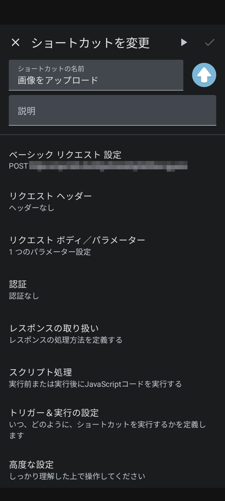
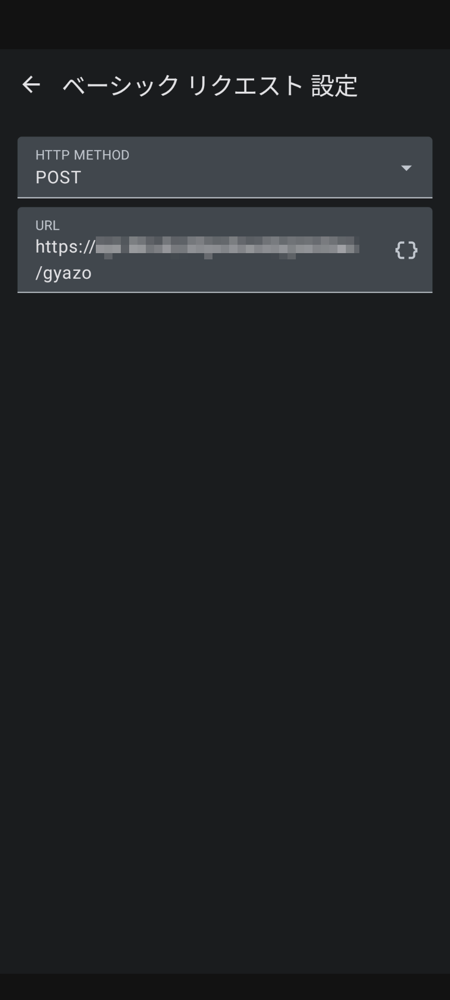
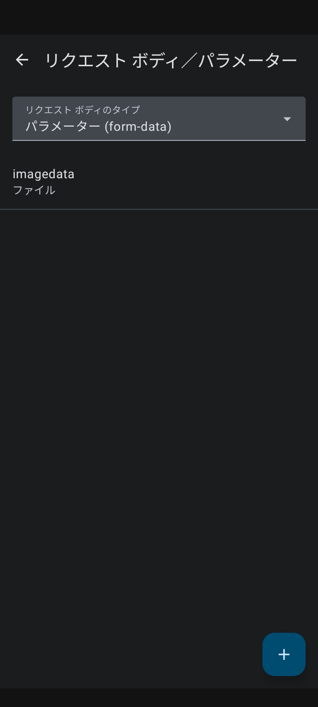
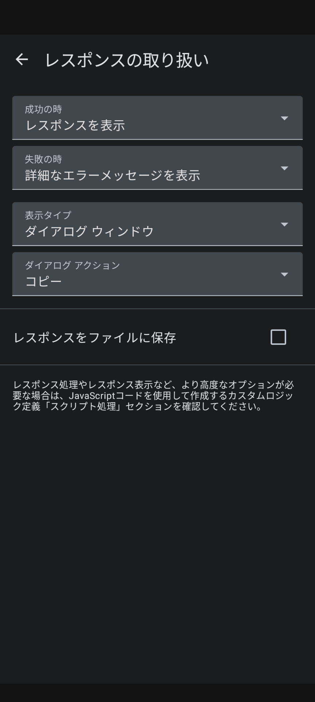

スマートフォンで撮った画像の Exif を除去しつつ、Gyazo にアップロードする、という作業を自動化するために、
Rust で API を実装した。

## 作ったもの

## なぜ作ったか

[以前のブログ]()で、複数の SNS にクロスポスト（マルチポスト？）することにしたと書いた。

投稿に画像を添付したいとき、クロスポスト先の SNS ごとに画像添付の処理を書く必要があった。  
とても面倒であるため、別のサービスに画像をアップロードし、その閲覧用リンクをテキストとして投稿に含めることにした。

画像のアップロード先は、以下の理由から [Gyazo](https://gyazo.com) にした。

- 以前から使っている
- Mastodon と Twitter でリンク先の画像を表示してくれる
  - Bluesky は別途対応が必要そう

しかし、Gyazo は Exif を削除しないため、スマートフォンで撮影した画像をそのままアップロードすると、位置情報を晒してしまう可能性があった。

プライバシーの観点から、 Exif を削除してから Gyazo に画像をアップロードしたいと考えていた。

## どう使っているか

スマートフォンから各 SNS に画像をアップロードしたいときに使っている。

API を叩くために、 [HTTP Shortcuts](https://http-shortcuts.rmy.ch/)というアプリ（Android 用）を利用している。

API は Gyazo のリンクを返すようにしているので、HTTP Shortcuts の設定ではダイアログにクリップボードにコピーするダイアログを表示する、または、自動でクリップボードにコピーするようにすると便利。

上記ショートカットのウィジェットををホーム画面に配置し、すぐ起動できるようにしている。

「ウィジェットをタップ」→「画像を選択」→「Gyazo リンクのコピー」の 3 タップでリンクをクリップボードに保持した状態にできる。

あとは、SNS の投稿作成画面で貼り付けるだけ。

### HTTP Shortcuts の設定

- 設定画面

  

- ベーシックリクエスト設定

  

- リクエストボディ/パラメーター

  

- レスポンスの取り扱い

  

## 余談

- はじめは Cloudflare Workers で運用するつもりだった
  - メモリ制限が厳しく、制限内に収めるためには画像をリサイズする必要があったため、セルフホストする方針とした
- Go で実装するつもりでいたが、せっかくなので Rust の経験値を積むことにした
- プロトタイプでは [image クレート](https://crates.io/crates/image) を使っていた
  - `image::load_from_memory` が遅かったため、 [TurboJPEG](https://docs.rs/turbojpeg/latest/turbojpeg/) を使うことにした
  - image クレートのときは Docker イメージに scratch を使えたので、イメージサイズがもっと小さかった
    - scratch で TurboJPEG を使う方法を知りたい
