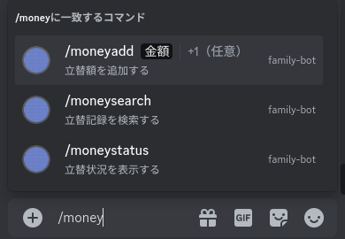
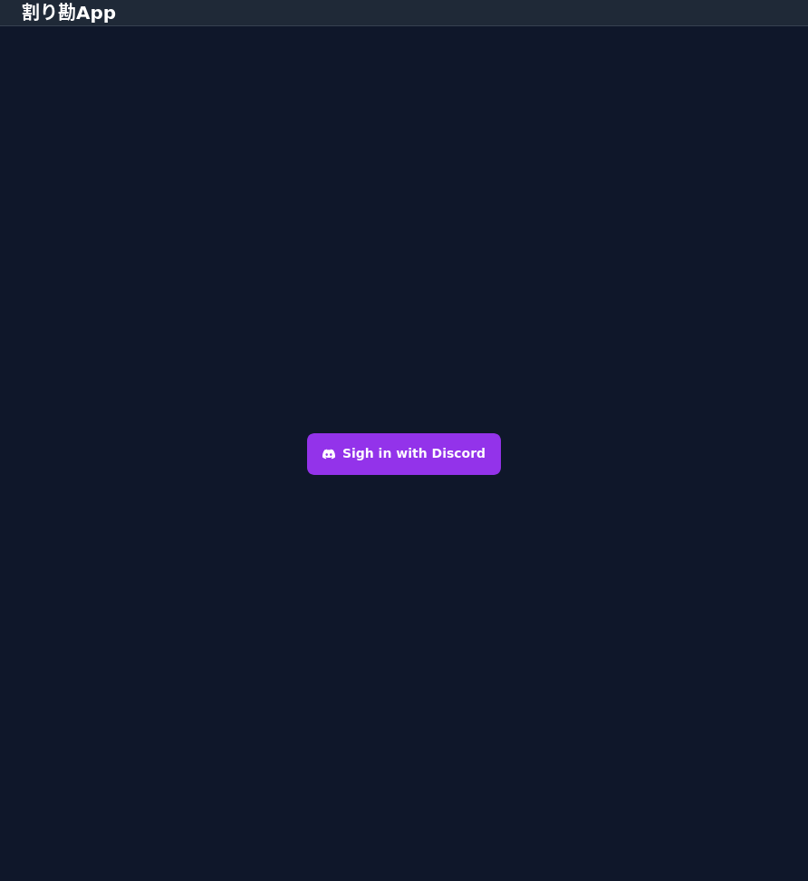
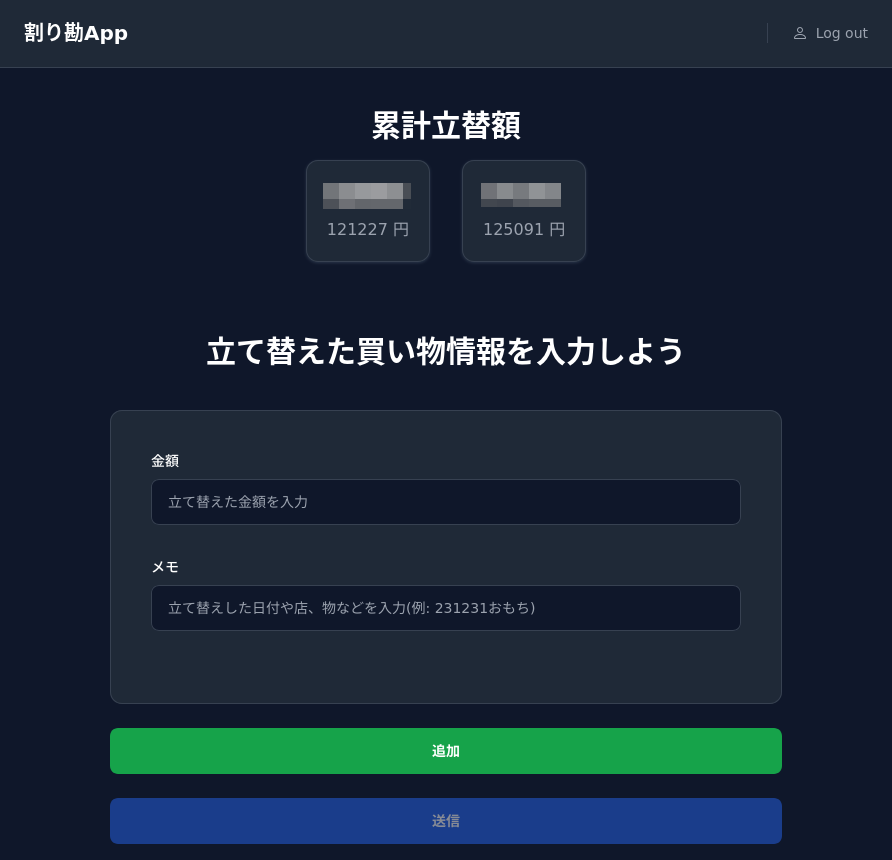

## 前提

家計はざっくり以下のルールで運用している。

1. 光熱費や固定費は按分
2. 家族用の消耗品・嗜好品は折半

1.の支払いはすべて私が担当しており、按分した金額を毎月振り込んでもらっている。

2.の方は「夫婦のどちらがどれだけ支払っているか」を可視化するアプリを自作し、負担状況がお互いにわかるようにした。

## 自作アプリ1 Discordボット

家族用の Discord サーバーを作って利用しているため、以下の機能を持つ Discord ボットを自作した。

- 購入したものと負担している（立て替えた）金額を記録する機能
- お互いの立て替え状況を表示する機能
- 記録を検索する機能

それぞれの機能は、Discord のスラッシュコマンドで呼び出せる。

- **実装言語**: Python
- **データベース**: SQLite
- **利用している主なライブラリ**
  - [Rapptz/discord.py: An API wrapper for Discord written in Python.](https://github.com/Rapptz/discord.py)
    - ボットのテンプレートはこちらを使っている。  
      [kkrypt0nn/Python-Discord-Bot-Template: 🐍 A simple template to start to code your own and personalized Discord bot in the Python programming language](https://github.com/kkrypt0nn/Python-Discord-Bot-Template)
  - [pydantic/pydantic: Data validation using Python type hints](https://github.com/pydantic/pydantic)
    - データのバリデーションに使っている。
  - [tiangolo/sqlmodel: SQL databases in Python, designed for simplicity, compatibility, and robustness.](https://github.com/tiangolo/sqlmodel)
    - Pydantic と互換性のある SQL ライブラリ。

Discord のスラッシュコマンドは引数を入力しやすくて好き。

## 自作アプリ2 Webアプリ

自作した Discord ボットは、一度のスラッシュコマンドで 1 つまでしか立て替え情報を入力できない。  
複数の立て替え情報を入力するには何度もスラッシュコマンドを入力しなければならず、これが煩わしかったので作った。

Web アプリには Discord の ID でログインする（OAuth2）。  
これは、先に作った Discord ボットで立て替え記録のユーザー識別のために、Discord のユーザーID を使っていたためである。  
Discord へのログインに成功したらサーバー側で Discord のユーザーID やユーザー名を取得し、JWT でクライアントに返却するようにしている。

以下はログイン後の画面。

- **実装言語**

  - バックエンド: Go
  - フロントエンド: TypeScript

- **利用している主なライブラリ**

  - バックエンド

    - [sqlc-dev/sqlc: Generate type-safe code from SQL](https://github.com/sqlc-dev/sqlc)
      - SQL から Go のコードを生成する。
    - [labstack/echo: High performance, minimalist Go web framework](https://github.com/labstack/echo)
      - Web サーバーとして使用している。
    - [ravener/discord-oauth2: Discord OAuth 2.0 for Golang](https://github.com/ravener/discord-oauth2)
      - Discord の OAuth 2.0 に使用している。
    - [golang-jwt/jwt: Community maintained clone of https://github.com/dgrijalva/jwt-go](https://github.com/golang-jwt/jwt)
      - Web アプリの認証に使用している。
    - [GitHub - gtuk/discordwebhook: Super simple interface to send discord messages through webhooks in golang](https://github.com/gtuk/discordwebhook)
      - Web アプリからの登録を Discord に通知するために使っている。

  - フロントエンド

    - [SolidJS](https://www.solidjs.com/)
      - 個人的に React よりもわかりやすい。特に、状態や再描画させる箇所の管理点で。
    - [Solid Form Handler](https://solid-form-handler.com/docs/introduction)
      - フォームの構築とバリデーションに使用している。
    - [Tailwind CSS](https://tailwindcss.com/)

## まとめ

自分や家族の役に立つものを作る、というのは実装意欲が湧き、新しいことを学ぶチャンスになってよい。

最初は全部 Rust で作ろうとしたけれど、一度作ってから Rust に書き換える方針にした。  
そのうち Rust での実装を開始したい。

需要がなさそうだけれど、公開リポジトリにしようか検討中。
