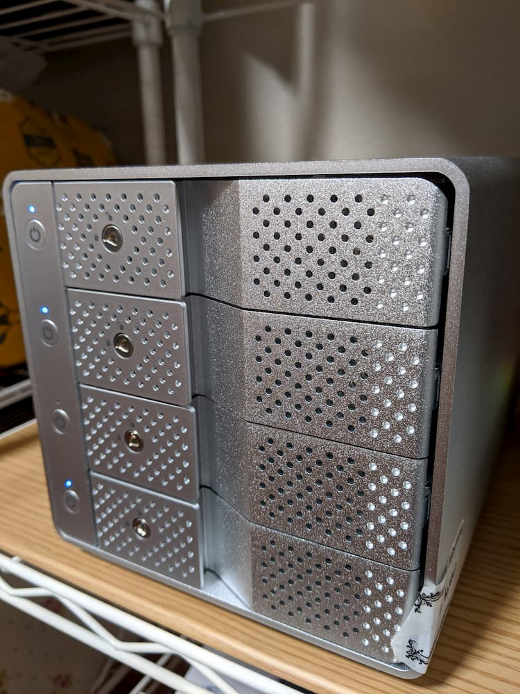

自宅サーバ (Intel NUC) をファイルサーバとしても運用するために、HDDを増設し、さらにRAID1に変換しました。  
ファイルシステムはbtrfsです。  

## 増設前

```
$ sudo btrfs filesystem show
Label: none  uuid: 305a40e0-c4d7-11e8-8c28-94c691a3435d
	Total devices 1 FS bytes used 73.99GiB
	devid    1 size 465.76GiB used 99.05GiB path /dev/sdb2

Label: 'hdd'  uuid: b80a9963-5ed9-488c-be88-d2a3eb2d6866
	Total devices 1 FS bytes used 1.36TiB
	devid    1 size 1.82TiB used 1.50TiB path /dev/sda
```

`hdd`というラベルがついているストレージプールをデータ保管用として使用しています。
ここにHDDを増設していきます。

増設のために[裸族のカプセルホテル USB3.1](https://www.century.co.jp/products/crch35u31cis.html)を購入しました。これをNUCのUSB3.1 Gen2のポートに接続する算段です。

## やったこと

### HDD増設

- HDDを接続  
  裸族のカプセルホテルをNUCに接続し、さらにHDDをケースに挿入します。  
  今回は4TBのHDDを2台挿入しました。それぞれデバイス名は`/dev/sdc`, `/dev/sdd`です。(デバイス名は環境によって変わります)

- btrfsにフォーマット  
  ```
  $ sudo gdisk /dev/sdc
  # n を入力 -> すべてデフォルトでよいのでEnter -> w を入力
  $ sudo gdisk /dev/sdd
  # 同様
  $ sudo partprobe
  $ sudo mkfs.btrfs -f /dev/sdc1
  $ sudo mkfs.btrfs -f /dev/sdd1`
  ```

- 既存のストレージプールに追加
  ```
  $ sudo mount -t btrfs /dev/sda /mnt/raid  # /mnt/raidに既存のストレージをマウント
  $ sudo btrfs device add -f /dev/sdc1 /dev/sdd1 /mnt/raid/
  ```

### RAID1に変換

増設後は以下のような感じです。

```
$ sudo btrfs filesystem show
Label: none  uuid: 305a40e0-c4d7-11e8-8c28-94c691a3435d
	Total devices 1 FS bytes used 73.87GiB
	devid    1 size 465.76GiB used 99.05GiB path /dev/sdb2

Label: 'hdd'  uuid: b80a9963-5ed9-488c-be88-d2a3eb2d6866
	Total devices 3 FS bytes used 1.36TiB
	devid    1 size 1.82TiB used 1.49TiB path /dev/sda
	devid    2 size 3.64TiB used 0.00B path /dev/sdc1
	devid    3 size 3.64TiB used 0.00B path /dev/sdd1
```

増設したHDDにはまだデータがないため、これを以下のコマンドでRAID1に変換しつつバランスよく再配置します。  
```
$ sudo btrfs balance start -dconvert=raid1 -mconvert=raid1 /mnt/raid
```

ストレージを1.3TiBくらい使用していたため、この処理は非常に時間がかかりました。(36時間くらい？)  
また、処理中にサーバが不安定になったため、一度再起動して再度実行をしました。  

### 定期的なディスクチェック

RAID1にしたので、定期的にデータの破損がないかチェックします。  

`/etc/cron.weekly`に`btrfs-scrub`というファイルを作成し、以下のコードを記述しました。  
```
#!/bin/sh
#
# run btrfs scrub on raid disk (label: hdd) weekly

set -e

btrfs scrub start /mnt/raid/
```

実行権限を付与するのも忘れずに。  

```
$ chmod +x btrfs-scrub
```

## RAID1への変換後

```
$ sudo btrfs filesystem show
Label: none  uuid: 305a40e0-c4d7-11e8-8c28-94c691a3435d
	Total devices 1 FS bytes used 73.28GiB
	devid    1 size 465.76GiB used 100.05GiB path /dev/sdb2

Label: 'hdd'  uuid: b80a9963-5ed9-488c-be88-d2a3eb2d6866
	Total devices 3 FS bytes used 1.37TiB
	devid    1 size 1.82TiB used 0.00B path /dev/sda
	devid    2 size 3.64TiB used 1.37TiB path /dev/sdc1
	devid    3 size 3.64TiB used 1.37TiB path /dev/sdd1

```
`/dev/sda`の使用量がゼロになっていますが、`btrfs balance`は容量の大きいディスクに優先してバランシングされるためです。  


Btrfs はディスクに分散してブロックペアを配置するのにラウンドロビン方式を使っています。Linux 3.0 から,ブロックペアを分散する際に大きなディスクを優先するように quasi-round-robin 方式が使われています。


```
$ sudo btrfs filesystem df /mnt/raid/
Data, RAID1: total=1.45TiB, used=1.45TiB
System, RAID1: total=32.00MiB, used=240.00KiB
Metadata, RAID1: total=4.00GiB, used=2.27GiB
GlobalReserve, single: total=512.00MiB, used=0.00B
```

無事にRAID1に変換できています。  
（コマンドを実行した日が異なるので、使用量が上記よりも少し増えています。）

## おわりに

ストレージプールへの追加やRAID1への変換は初めて経験しましたが、とても簡単にできました。btrfsは便利でいいですね。

写真は裸族のカプセルホテルです。上2つのランプが点いている箇所に増設したHDDを挿れています。



一番下のランプも点いていますが、これはバックアップ用のHDDです。  
バックアップについてもいずれ記事にしたいと思います。
