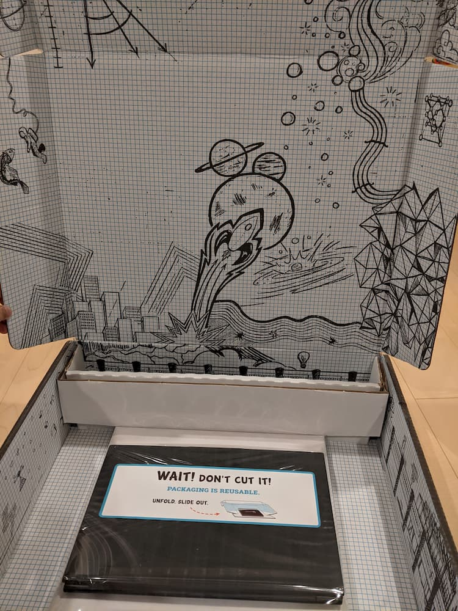
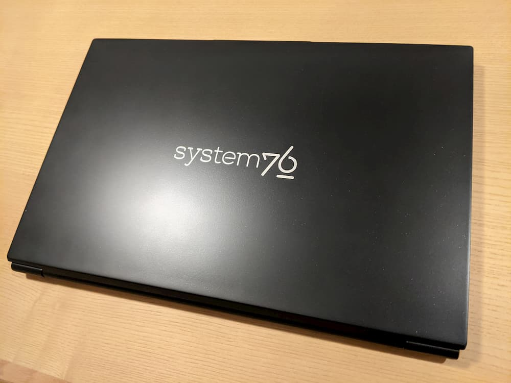
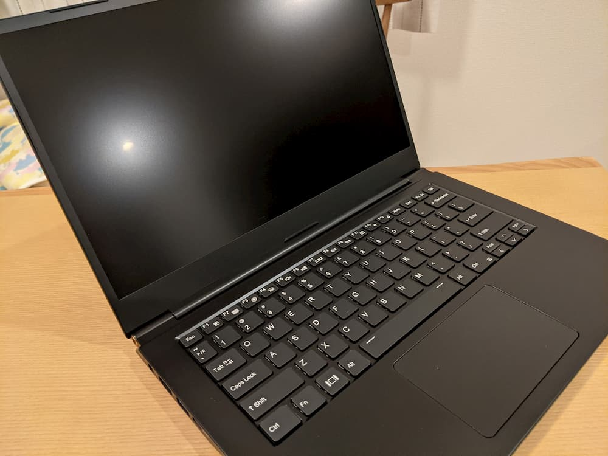

この記事は新しいノートPCを買ってセットアップした、というお話です。  

## 購入したノートPC

これまでZenbook 3にLinux Mintを入れて使っていたのですが、ディスプレイが壊れてしまったためノートPCを新調することにしました。  
普段使いでもLinuxで事足りることがわかったため、今回は最初からLinuxがインストールされたノートPCを買うことにしました。  

Webの記事[^1]を見て良いなと思ったので、[Lemur Pro](https://system76.com/laptops/lemur)の購入を決定。米ドルでの決済になるため、購入の際には通常のクレジットカードよりもレートが良い[Revolut](https://www.revolut.com/ja-JP)を使いました。Revolutの話は本題から外れるので割愛します。  
Lemur Proは購入後、クレジットの請求元情報内に埋め込まれたパスコードを送るように、というメールが届きます。私の場合、Revolutの履歴にパスコードが含まれていなかったため、サポートに連絡しました。Revolutアプリから、パスコードが埋め込まれているはずなので教えてほしい、とオペレーターにチャットすることでパスコードを把握できました。このパスコードをメールで返信したところ、組み立て中、というステータスに変わりました。私が購入したときはちょうどFirmwareの修正を行なっていたようで、受け取れたのは購入から1ヶ月後でした。通常ではもっと早く受け取れるようです[^2]。

📷箱を開けたところ↓遊び心のあるポップな箱です。  

📷外観

📷ディスプレイとキーボード

余談ですが、オペレーターに教えてもらってから数日後にアプリの履歴からもパスコードを確認できました。ただ、オペレーターから教えてもらった番号とは異なっていました。私はオペレーターから教えてもらったパスコードをメールで返信し、無事商品を受け取っています。オペレーターから教えてもらったパスコードが正しいのだとすると、アプリ上のパスコードは間違っていることになりますが、真偽は不明です。

[^1]: [14.1インチで990gの薄型軽量LinuxノートPCが登場【最大40GB RAM！？】](https://daily-gadget.net/2020/03/24/post-12876/)

[^2]: [本日の買い物：Lemur Pro](https://skoji.jp/blog/2020/06/lemur-pro.html)

## ファイルシステムをBtrfsに

最初からPop!_OSがFull Disk Encryptionの状態でインストールされていたのですが、ファイルシステムはext4でした。私はBtrfsを好んで使用しているため再度OSをインストールしました。

OSはLinux Mintにするつもりでしたが、タッチパッドが効かないという現象を確認したため、Pop!_OSを使用することにしました。Pop!_OSをBtrfsでインストールする手順は、[こちらのページ](https://mutschler.eu/linux/install-guides/pop-os-btrfs/)を参考にしました。さらに、Btrfsのスナップショットに備えていくつかのディレクトリをサブボリュームにしました[^3] [^4]。

[^3]: [Linuxファイルシステムの概要 | ストレージ管理ガイド | SUSE Linux Enterprise Server 15 SP1](https://documentation.suse.com/ja-jp/sles/15-SP1/html/SLES-all/cha-filesystems.html#sec-filesystems-major-btrfs-suse)
[^4]: [デスクトップLinuxにBtrfsとSnapperを使うようになってファイルを間違えて削除してしまう恐怖から開放されました - ncaq](https://www.ncaq.net/2019/01/28/13/37/05/)
## おわりに

ノートPCを新調した話でした。Lemur Proは軽くて持ち運びしやすい上にUSB-PDが使えるので、Zenbook 3から乗り換えるにはちょうどよい機種だったと思います。

OSインストール後の環境構築の話は別記事にしたいと思います。
