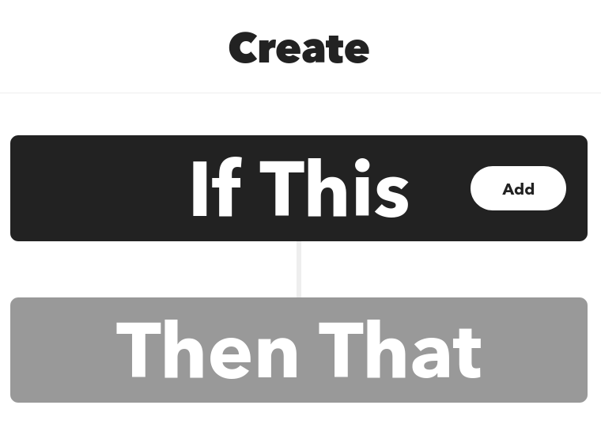
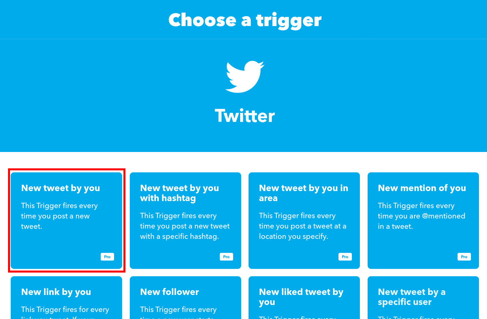
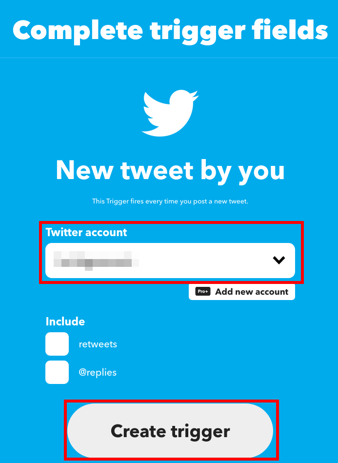
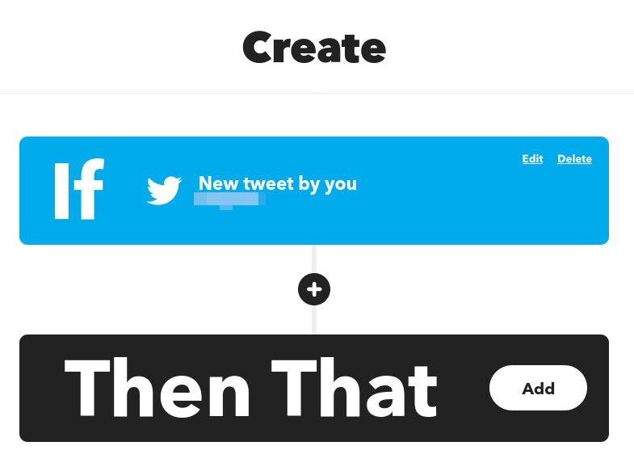
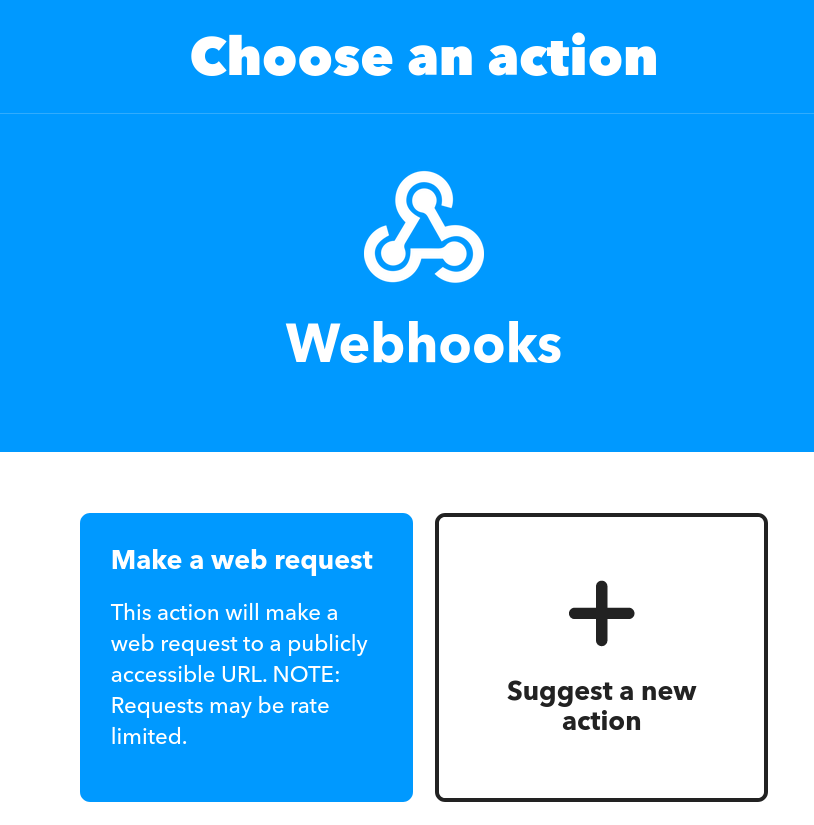
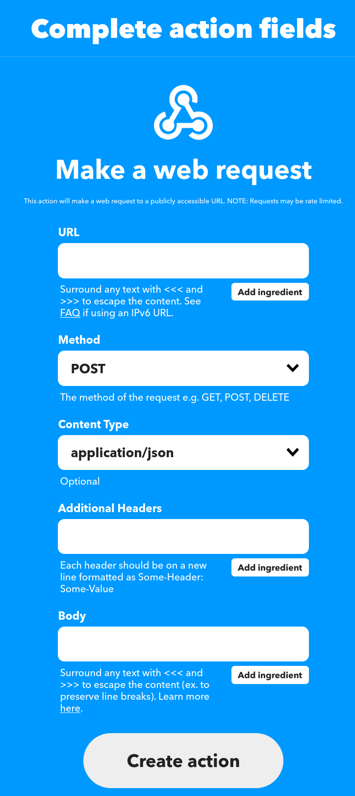
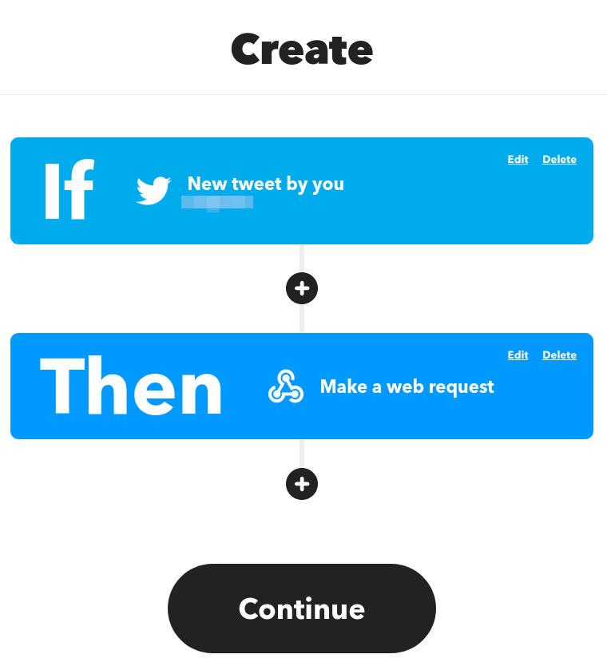
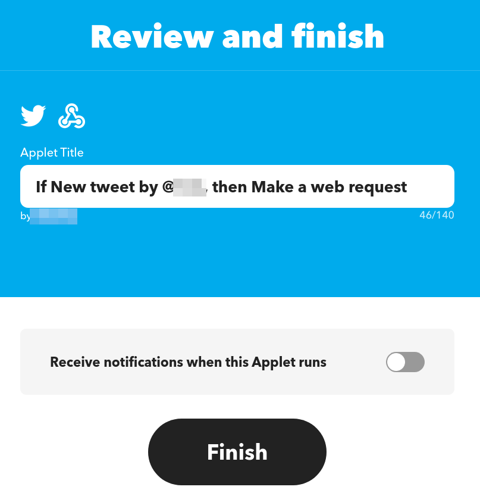

Twitter（名称が X に変わったが、本記事では旧称を使用する）のバックアップとして Mastodon と Bluesky を使うことにした。  
Mastodon インスタンスについてはこちら: [SAML 認証の Mastodon インスタンスのセットアップ]())

それぞれに同じ内容を手作業で投稿するのは面倒であるため、自動化する仕組みを作った。

## 仕組み

- IFTTT で Twitter への投稿をトリガーとするアプレットを作る
  - アクションは Webhook とし、後述する Cloudflare Workers に対して投稿内容を POST する
- Cloudflare Workers にデプロイしたアプリケーションは、POST された内容を Mastodon / Bluesky に投稿する

IFTTT は Pro 以上のプランである必要がある。

Cloudflare Workers にデプロイするアプリケーションは自作した。  
それぞれのリポジトリは以下の通り。  
練習も兼ねて Rust で実装している。

## 設定

### Cloudflare Workers

下記の手順は Cloudflare アカウントを所持していること、`wrangler` がインストールされていることを前提としている。

`toot-worker` と `bluesky-worker` で同一の手順であるが、詳細は各リポジトリの README を参照いただきたい。

1. リポジトリをブラウザで開き、`Use this template` ボタンをクリックし、さらにローカル環境にクローンする。

2. `npx wrangler publish` を実行する。

   ここで発行された URL は、次の IFTTT の設定で使用する。

3. `wrangler secret put <secret>` を実行する。  
   `secret` は各リポジトリの README を参照。

### IFTTT

アプレット作成画面を開き、以下の手順で設定する。

1. `If This` の Add をクリックし、サービス一覧から Twitter を選択する。

   

2. `New tweet by you` をクリックする。

   

3. `Twitter account` で対象とするアカウントを選択し、`Create trigger` をクリックする。

   IFTTT と Twitter を連携していない場合は、下記画像の画面ではなく `Connect` というボタンのある画面が表示されるはず（すでに連携済みのため、未確認）。  
   その場合は、`Connect` をクリックしてアカウントを連携する必要がある。

   

4. `Then That` の Add をクリックし、サービス一覧から `Webhooks` を選択する。

   

5. `Make a web request` をクリックする。

   

6. 各項目を以下のように入力し、`Create trigger` をクリックする。

   - `URL`: `toot-worker` または `bluesky-worker` の Cloudflare Workers の URL
   - `Method`: `POST` を選択する
   - `Content Type`: `application/json` を選択する
   - `Additional Headers`: 空のままでよい
   - `Body`: `{"text": "<<<{{Text}}>>>"}`  
     （`{{Text}}` は `Add ingredient` をクリックして `Text` を選択することでも入力できる）

   

7. `Continue` をクリックし、Applet のタイトルを修正して `Finish` をクリックする。

     
   

## おわりに

クロスポストする仕組みはできたが、課題はある。
URL が Twitter の短縮 URL になってしまう、たまに Mastodon や Bluesky への投稿が失敗する、といった事象を確認している。

また、Bluesky は Rich Text 形式で投稿する必要があるのだが、今回作った仕組みにはまだ実装できていない。  
このように、課題はたくさんあるので、もう少し改良したい。
