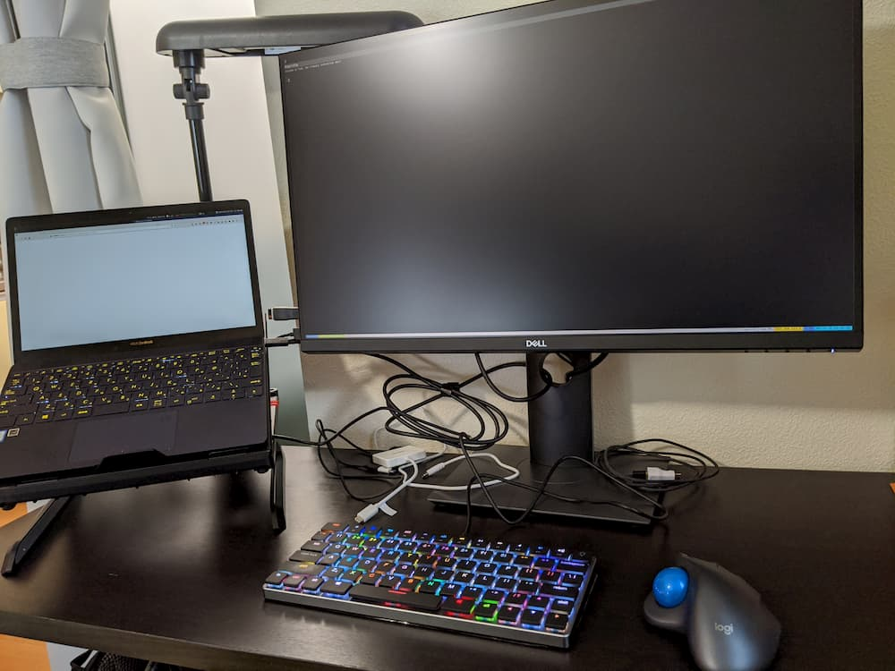

ディスプレイが古くなってきたので、新しいディスプレイを買いました。  
買ったのは、[DELLのP2720DC](https://www.dell.com/ja-jp/shop/dell-%E3%83%97%E3%83%AD%E3%83%95%E3%82%A7%E3%83%83%E3%82%B7%E3%83%A7%E3%83%8A%E3%83%AB%E3%82%B7%E3%83%AA%E3%83%BC%E3%82%BA-p2720dc-27%E3%82%A4%E3%83%B3%E3%83%81%E3%83%AF%E3%82%A4%E3%83%89-usb-c%E3%83%A2%E3%83%8B%E3%82%BF/apd/210-auow/%E3%83%A2%E3%83%8B%E3%82%BF%E3%83%BC-%E3%83%A2%E3%83%8B%E3%82%BF%E3%83%BC%E3%82%A2%E3%82%AF%E3%82%BB%E3%82%B5%E3%83%AA%E3%83%BC)です。  

## 購入のきっかけ

10年近く20型のディスプレイ2枚を使っていました。  
しかもそれらは1280x720程度の解像度です。  
さすがに一画面の情報量が少なく感じてきたことと、自宅での作業頻度が増えたことから、大きいディスプレイの購入を決めました。  

## 重視した点

ディスプレイを選ぶときに、3つの点を重視しました。  
- 解像度はWQHD、サイズはそれほど大きくないもの
- 入力端子にUSB Type-Cがある
- できればUSB Type-Cで給電できる

自宅のデスクが幅も奥行きも小さいため、最初にサイズを27インチに決めました。  
27インチで解像度を4Kにしてしまうと、文字が小さすぎて逆に作業効率が落ちる予感がしたので、WQHDにしました。  

次に、手持ちのノートPCがUSB Type-Cを搭載しているので、配線のスッキリさせるためにUSB Type-Cの入力を条件に加えました。  

せっかくUSB Type-Cで接続するなら給電もできた方がいいですよね。  

このようにして、P2720DCに行き着きました。  

## 外観

他のケーブルも見えていますが、ノートPCにはケーブル一本だけ繋がっています。  
一本で画面出力と給電を同時にできるのは、やはりとても便利です。  

デスクトップPCも持っていますが、最近はもっぱら写真のスタイルのようにノートPCで作業しています。  

## おわりに

周辺機器は定期的に買い替えたほうがよいなと改めて思いました。  
作業効率が段違いです。  
余談ですが、ディスプレイ設置のついでに、デスクの下に無造作に置いていた電源タップとコードを宙に浮かせたので、足元もスッキリしました。  
