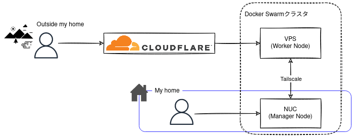
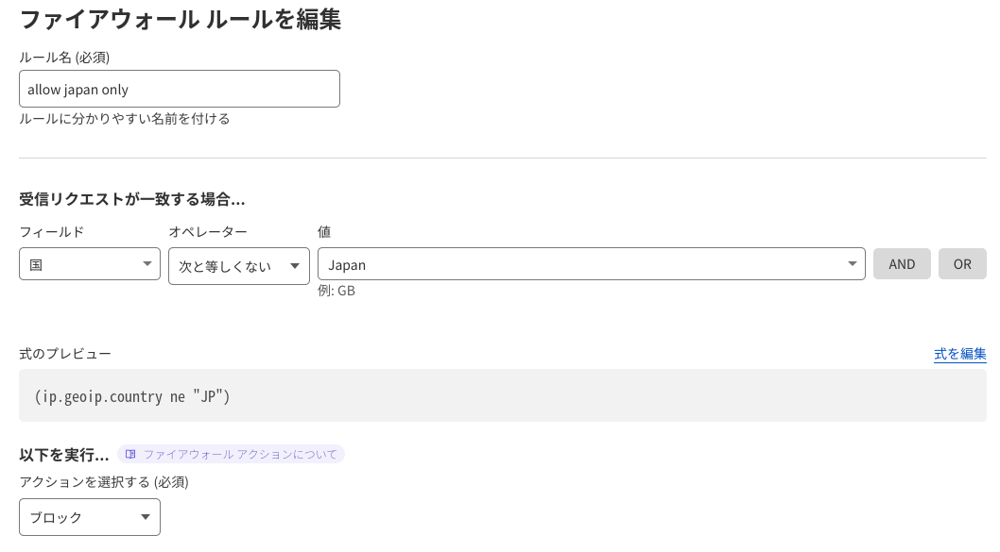
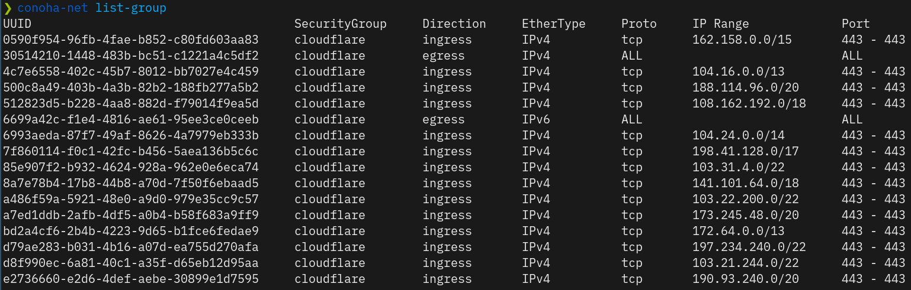

自宅ネットワーク内のサーバに立てたサービスにグローバルからアクセスできるようにした。

## はじめに

これまで自宅ネットワーク内のサーバに色々なサービスを立ててきたが、外出時に利用する際はVPNを張っていた。  
外出時に最も使用したいサービスはAdblockサーバであり、そのために常時VPNを張る必要があった。  
そうすると必然的にバッテリー消費が激しく、改善したいと考えていた。  

VPNなしで外部からアクセスできるようにすることは以前からやりたかったことでもあるので、構成やセキュリティを考えて実現してみた。

## 構成

現在、図のような構成になっている。  

[Tailscale](https://tailscale.com/)を使って自宅ネットワーク内のNUCと、ConoHaに立てているVPSインスタンスでSwarmクラスタを形成している。
これについては以前[別の記事]()に書いている。

各サービスにはドメインでアクセスできるようにしており、外出時は[Cloudflare](https://www.cloudflare.com/)を介してVPSにアクセスする形でサービスを利用する。  
家のネットワークにいるときは直接NUCにアクセスするよう内部DNSサーバにレコードを設定している。

この構成の優れた点は、家のルータ設定を全く変更せずに自宅サーバに立てたサービスにアクセスできることだと考えている。

## ルーティング

サービスごとにサブドメインを割り当て、443/tcpで待ち受けている[Traefik](https://github.com/traefik/traefik)が各サービスにルーティングするようにしている。

自宅ネットワーク内部からのアクセスは直接NUCで受信、外部からのアクセスはVPSで受信、という処理を実現するために、IngressモードでTraefikのポートを公開している。

Ingressモードで公開した場合、そのままではクライアントのIPアドレスを取得できないため、各ノードで[docker-ingress-routing-daemon](https://github.com/newsnowlabs/docker-ingress-routing-daemon)を使っている。

## セキュリティ

グローバルからアクセスできるようにするので、できるだけセキュアな設定にする。

### Cloudflare

Cloudflareをプロキシに使うために、ドメインのネームサーバをCloudflareのものにしている。  
ドメインのAレコードにはVPSのIPアドレスを設定し、プロキシを有効（オレンジの雲）にしている。  
これによって、VPSのIPアドレスが隠蔽される。  
また、プロキシを有効にした状態でドメインへアクセスがあった場合、VPSからは接続元がCloudflareのIPアドレスに見えるため、後述するようにVPSではCloudflareのIPアドレスからのアクセスのみ許可すればよくなる。

暗号化モードをフル（厳格）にし、HSTSを有効にしている。  
証明書はTraefikでLet's Encryptの証明書を発行するようにしている。  
設定は次のページを参考にした。

- [Cloudflare Settings for Traefik Docker: DDNS, CNAMEs, & Tweaks | SHB](https://www.smarthomebeginner.com/cloudflare-settings-for-traefik-docker/#4_Firewall)

ファイアウォールでは、日本以外からのアクセスをブロックしている。  
立てているサービスは自分用であり、日本以外からのアクセスをブロックしても特に困らないので。

### VPS

VPSはConoHaのものを使っている。  
インスタンス側のファイアウォール設定はDockerが絡んでくると面倒な印象がある[^2]ので、ConoHaのファイアウォールでCloudflareのIPアドレスからの443/tcpアクセスのみを許可している。

[^2]: [Docker and iptables | Docker Documentation](https://docs.docker.com/network/iptables/)

ConoHaファイアウォールの設定には、[conoha-net](https://github.com/hironobu-s/conoha-net)というツールを使った。  
CloudflareのIPアドレス帯は複数[^1]あり、これら一つ一つからの443/tcpへのアクセスを許可するセキュリティグループルールを作った。  
`conocha-net` の使い方とセキュリティグループについては、READMEや次のページが参考になる。

- [ConoHaでセキュリティグループを設定する - Qiita](https://qiita.com/hironobu_s/items/1bb6a8886ae91bb553c9)

[^1]: [IP Ranges | Cloudflare](https://www.cloudflare.com/ips/)

セキュリティグループは次のような感じ。

### 認証・認可

Swarmノードに立てているサービスには、[Authentik](https://goauthentik.io/)で認証を掛けている。  
Authentikも他のサービスと同様にSwarmノード上に立てている。

サービスがSAMLやOAuth2などのSSOに対応していれば優先的に利用し、対応していない場合はForward authを使うようにしている。  

Authentikのデフォルトのログインフローの設定ではブルートフォース対策に心許なさを感じたので、少し改良した。あとで別記事にしようと思う。  

## おわりに

自宅サーバの構成についてざっくりと記述した。  
この記事を書いている時点ではまだAdblockサーバしかグローバルから使えるようにしていないが、もう少し様子を見てからNextcloudなど別のサービスも使えるようにする予定。

