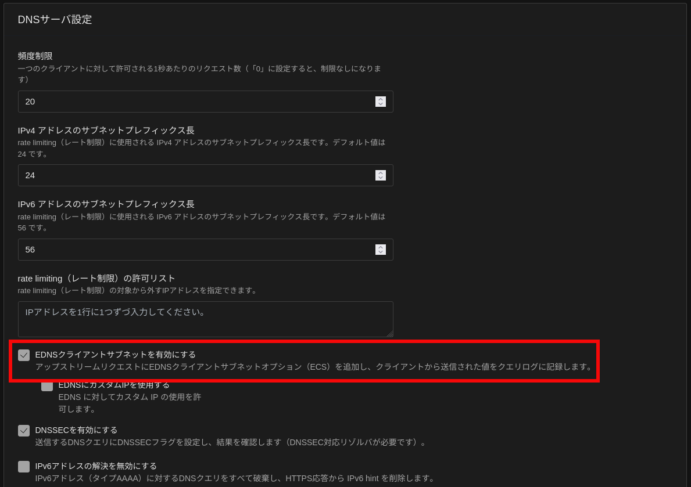
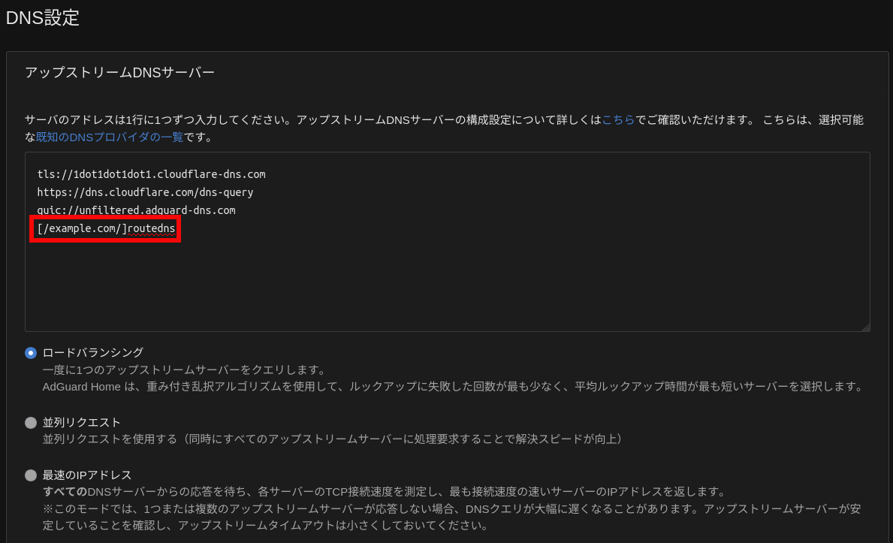
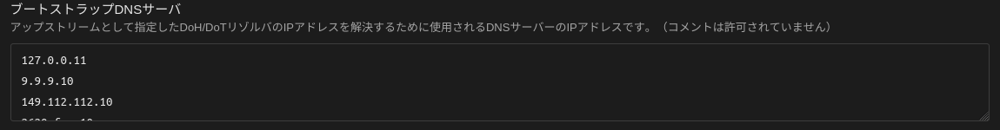

[AdGuard Home](https://github.com/AdguardTeam/AdGuardHome) の ECS (EDNS Client Subnet) 付与機能と [RouteDNS](https://github.com/folbricht/routedns) を組み合わせることで、自宅サーバで起動している各アプリケーションに自宅内からも外出先からも同じドメイン名でアクセスできるようにした。

## 前提

- 自宅ネットワークに AdGuard Home を DNS サーバ兼広告ブロッカーとして設置している
- AdGuard Home 以外にも複数のアプリケーションを自宅ネットワークで運用しており、一部は外部からも利用する
    - [Traefik](https://github.com/traefik/traefik)をリバースプロキシとして利用し、各アプリケーションには、`appname.example.com` のようなドメインでアクセスできるようにしている
    - インターネットから自宅ネットワークへのアクセス方法は、以前のブログ記事を参照
      - [Cloudflare、Traefik、Authentik を使った自宅 Docker サーバ · blog.bridgey.dev]()
    - 外出時も AdGuard Home を端末の DNS サーバに設定し、広告ブロックを利用している
- AdGuard Home を含む各アプリケーションは Docker で起動している

## 解決したいこと

- 自宅内からアクセスする場合も、外出先からアクセスする場合も、同じドメイン名で自宅サーバ上のアプリケーションにアクセスしたい
  - 自宅からアクセスする際は、プライベート IP アドレスで名前解決したい
  - 外出先からアクセスする際も、自宅ネットワーク内でアクセスするときと同じドメイン名で名前解決したい
- 外出時に自宅ネットワークに VPN を張る方法以外で実現したい
  - 以前は [Tailscale](https://tailscale.com/) を使っていたが、スマートフォンのバッテリーの減りが早かったため

## 課題

- AdGuard Home に単純にプライベート IP アドレスを登録すると、外部からアクセスできなくなる
- 外部からのアクセス時に AdGuard Home を利用しない場合、広告ブロックが機能しなくなる

単純に外出先からアクセスできるようにすると、自宅内のアプリケーションにアクセスするためにわざわざインターネットを経由することになるので、自宅内ではアプリケーションに直接アクセスできるようにしたい。

反対に、各サービスのプライベート IP アドレスを AdGuard Home に登録してしまうと、外部に公開しているアプリケーションに外出先からアクセスできなくなってしまう。

## 解決方法

名前解決要求に付与されている ECS が自宅ネットワーク外のものであれば外部の DNS サーバに問い合わせ、そうでなければ自宅サーバの IP アドレスを返すようにする。

これを、AdGuard Home の ECS 付与機能と RouteDNS を組み合わせて実現した。

ECS に基づいて名前解決の挙動を切り替える機能を持つ DNS サーバであれば、RouteDNS 以外のツールでも代用可能。

## 設定手順

### 1. Traefikで使用しているDockerネットワークのアドレスレンジを、AdGuard Homeの設定ファイル内の `trusted_proxies` に追加する

この設定は、AdGuard Home が接続元 IP アドレスを正しく認識するために重要となる。
Traefik を経由して AdGuard Home にアクセスする場合、デフォルトでは Traefik の IP アドレスが接続元として認識されてしまう。

`trusted_proxies` に Traefik が使用する Docker ネットワークのアドレスレンジを追加することで、AdGuard Home は本来のクライアント IP アドレスを認識し、ECS 付与機能が正しく動作するようになる。

以下は、Adguard Home の設定ファイルの該当部分。

```yaml
dns:
  # 中略
  trusted_proxies:
    - 127.0.0.0/8
    - 172.16.0.0/12  # TraefikのDockerネットワークのアドレスレンジに合わせて変更
    - ::1/128
```

### 2. AdGuard HomeのGUI、または、設定ファイルでECSの付与機能を有効にする

AdGuard Home の ECS 付与機能を有効にすることで、DNS クエリにクライアントの IP アドレス情報（ECS）が付加されるようになる。
この情報に基づいて、RouteDNS が名前解決の挙動を切り替える。

- 設定ファイルを編集する場合

    ```yaml
    dns:
      # 中略
      edns_client_subnet:
        custom_ip: ""
        enabled: true
        use_custom: false
    ```

- GUI から設定する場合

    

### 3. RouteDNSをAdGuard Homeからアクセスできるように起動する

RouteDNS は、AdGuard Home からの DNS クエリを受け取り、ECS 情報に基づいて適切な IP アドレスを返す。RouteDNS を Docker コンテナとして起動し、AdGuard Home からアクセスできるように設定する。

私は、AdGuard Home と RouteDNS を同じ Docker ネットワークにしている。

- `compose.yml` と RouteDNS の Dockerfile の例

    ```bash
    $ cat compose.yml
    services:
      adguard:
        image: adguard/adguardhome:v0.107.57
        init: true
        restart: unless-stopped
        ports:
          #- 3000:80  # web-uiのポート。初回アクセス時の設定でフォワードポートが変わる点に注意
          - 53:53/udp
        volumes:
          - ${WORK_DIR:-./data/work}:/opt/adguardhome/work
          - ${CONF_DIR:-./data/conf}:/opt/adguardhome/conf
        logging:
          driver: json-file
          options:
            max-size: 12m
            max-file: '5'
        depends_on:
          - routedns

      routedns:
        # Docker Hubのイメージはバージョンが古いので自前でビルド
        build:
          context: routedns
        init: true
        restart: unless-stopped
        volumes:
          - ./config.toml:/app/config.toml  # 以下に示すroutednsの設定ファイル
        logging:
          driver: json-file
          options:
            max-size: 12m
            max-file: '5'

    $ cat routedns/Dockerfile
    FROM public.ecr.aws/docker/library/golang:1.24 AS builder

    WORKDIR /

    RUN go install -tags netgo -ldflags '-extldflags "-static"' github.com/folbricht/routedns/cmd/routedns@v0.1.103

    FROM scratch
    WORKDIR /app

    COPY --from=builder /etc/ssl/certs/ca-certificates.crt /etc/ssl/certs/ca-certificates.crt
    COPY --from=builder /go/bin/routedns .

    ENTRYPOINT ["./routedns"]

    CMD ["./config.toml"]
    ```

- RouteDNS の設定ファイルの例

    ```bash
    $ cat config.toml
    [routers.my-router]
    routes = [
        {name = '(^|\.)example\.com\.$', types = ["A", "AAAA"], resolver="ecs-root"},
        {resolver="ecs-delete"},  # default route
    ]

    [groups.ecs-root]
    type = "client-blocklist"
    use-ecs = true
    # blocklist に該当しない場合に使用するresolver
    resolvers = ["static-a-of-hoge"]
    blocklist-resolver = "ecs-delete"
    # 私はmineo回線を利用しているため、以下ページのCOMPANYがOPTAGE Inc.のNETBLOCKを抜き出した
    # https://ipinfo.io/AS17511
    blocklist = [
      "<snip>"
    ]

    [groups.static-a-of-hoge]
    type = "static-responder"
    answer = ["IN A 192.0.2.100"]

    [groups.ecs-delete]
    type = "ecs-modifier"
    resolvers = ["cloudflare-doh"]
    ecs-op = "delete"

    [resolvers.cloudflare-doh]
    address = "https://1.1.1.1/dns-query{?dns}"
    protocol = "doh"
    doh = { method = "GET" }

    [groups.query-log]
    type = "query-log"
    resolvers = ["my-router"]
    # output-file = "/tmp/query.log" # Logs are written to STDOUT if blank, uncomment to write to file
    output-format = "text"

    [listeners.local-udp]
    address = ":53"
    protocol = "udp"
    resolver = "query-log"
    # resolver = "my-router"
    ```

### 4. AdGuard Homeで、`example.com` （各サービスへのアクセスに使用しているドメイン）の名前解決先をRouteDNSにする

AdGuard Home に対して、特定のドメイン名 (`example.com`) の名前解決を RouteDNS に委譲するように設定する。
これにより、AdGuard Home は、`example.com` に関する DNS クエリを RouteDNS に転送し、RouteDNS が ECS 情報に基づいて適切な IP アドレスを返す。

- アップストリーム DNS サーバーの設定に、以下のように記述する
  - `[/example.com/]routedns`

  

- コンテナ名で名前解決できるように、ブートストラップ DNS サーバーに `127.0.0.11` を追記する

  - 参考: [Update v0.107.30 causes connection and speed drops. · Issue #5874 · AdguardTeam/AdGuardHome](https://github.com/AdguardTeam/AdGuardHome/issues/5874#issuecomment-1600251760)

  - GUI で設定する場合

    

  - 設定ファイルを編集する場合

    ```yaml
    dns:
      upstream_dns:
        # 中略
        - '[/example.com/]routedns'  # example.comの名前解決をするサーバをroutednsに設定
      bootstrap_dns:
        - 127.0.0.11  # コンテナ名で名前解決できるように追加
    ```

### 5. スマートフォンの名前解決先をAdGuard Homeにする

DoH (DNS over HTTPS) で名前解決できるようにするアプリをスマートフォンにインストールしておき、外出時にアプリを有効化する。

例: Android の場合、Intra、Rethink など。

Cloudflare を用いて AdGuard Home にアクセスできるようにしているため、アプリには Adguard Home の DoH の URL を設定している。

アプリは VPN 接続をすることで DoH を有効にしているが、 Tailscale よりもバッテリーの持ちが（体感で）よいと感じている。

