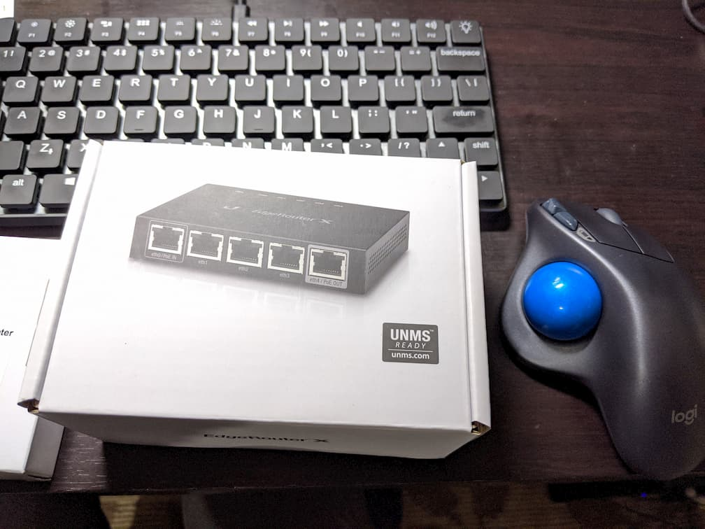
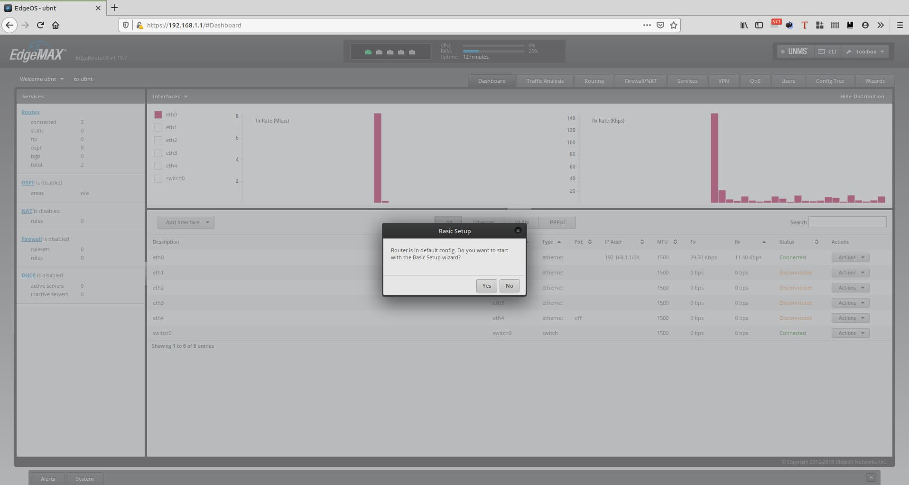
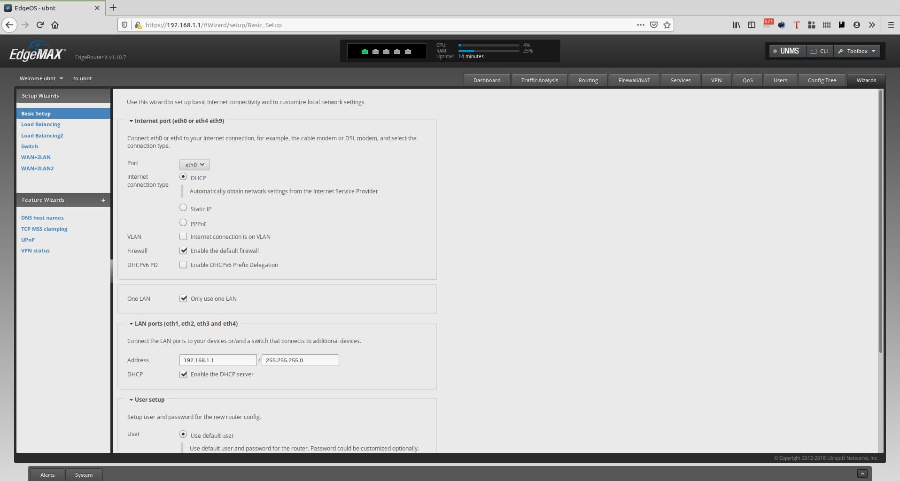
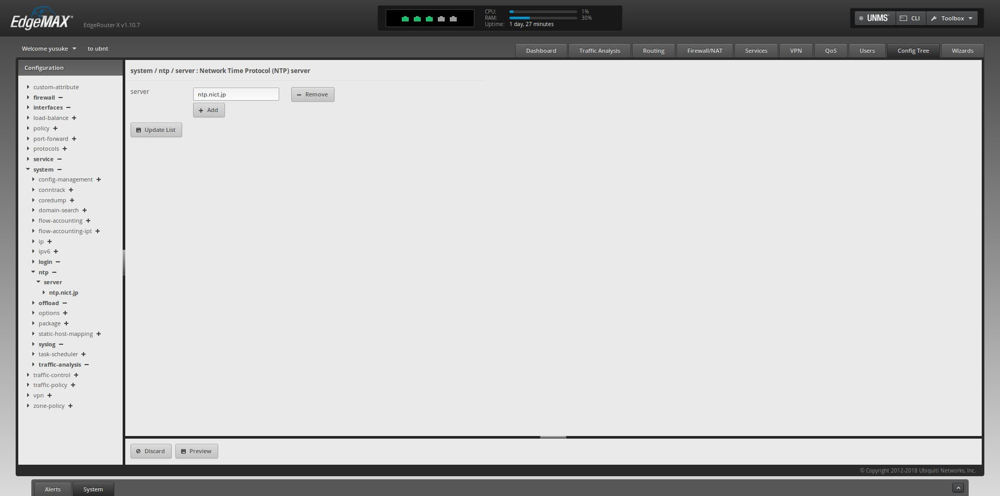
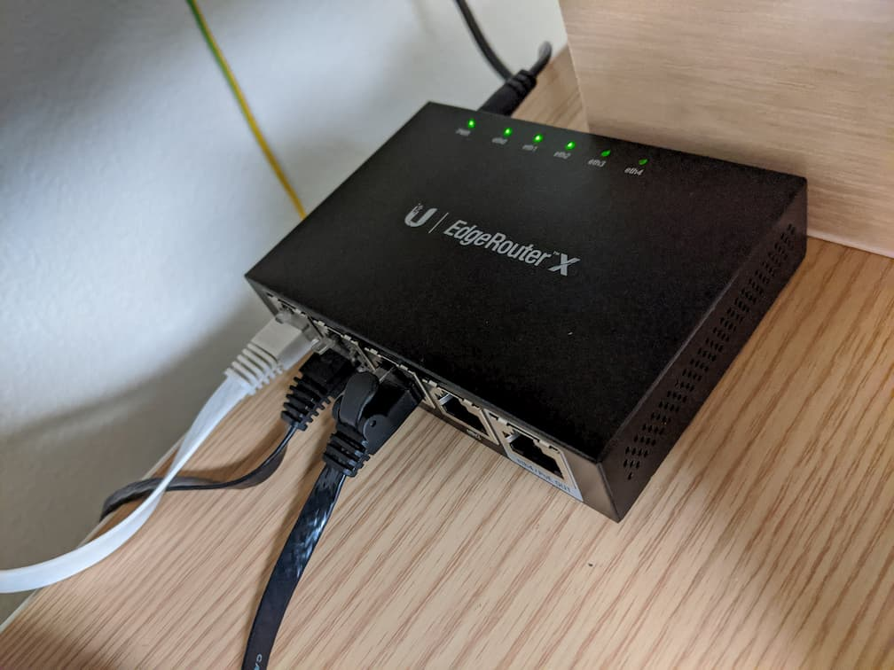
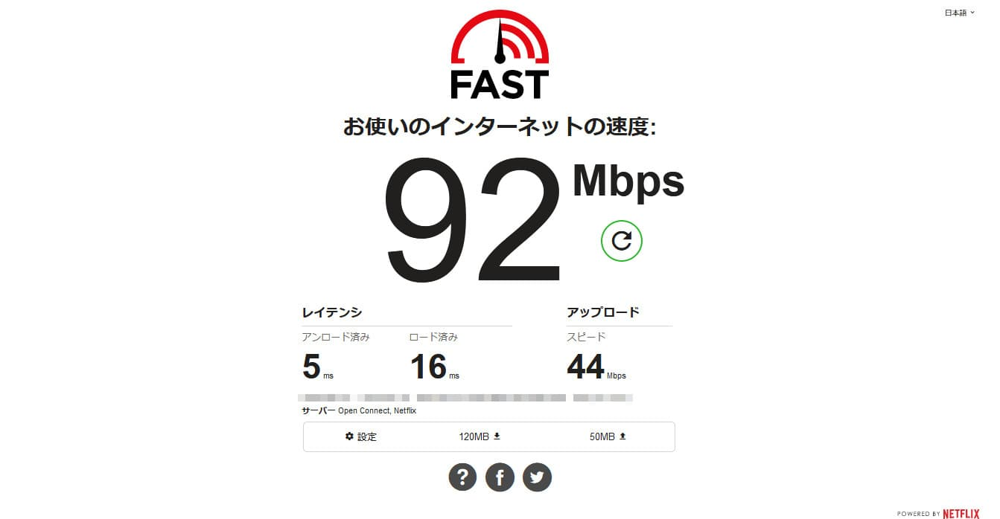

高機能なルータが欲しかったので、コスパが良いと言われている[EdgeRouter X](https://www.ui.com/edgemax/edgerouter-x/)を買いました。  

# EdgeRouter Xとは

50ドル程度で高機能なルータと同程度の機能を備えたルータです。  
VLANやOpenVPN、DDNSなど、自宅で遊ぶには十分すぎます。  
私はAmazon.co.jpで9,999円で購入しました。  

梱包はこんな感じです。  

基本的な設定はGUIでできるとはいえ、一般的な家庭用ルータの設定よりもネットワークの知識が必要なので注意が必要です。  

# やったこと

自宅のルータをEdgeRouter X (以下、ER-Xと記述します) に置き換えるために、[EdgeRouter X – 1. 初期設定](https://yabe.jp/gadgets/edgerouter-x-01-set-up/)を参考に設定を変更しました。  

## 初期設定

私が購入した際のファームウェアバージョン`v1.10.7`では、初めてアクセスした際に以下のような`Basic Setup`を促す通知が表示されました。  

`Yes`をクリックし、`Basic Setup`に入ります。  

環境によって、適宜値を変えましょう。  
私の場合、`Basic Setup`では以下のような値にしました。  

- Internet Connection Type: PPPoE
- Address: 192.168.10.1 / 255.255.255.0
- DHCP: チェックを外す  
    DHCPサーバを別にたてているため  

Systemタブでの設定は以下のようにしました。  

- タイムゾーンを`Japan`に変更
- SSHのポートを60022に変更

## ハードウェアオフロードを有効にする

[EdgeRouter X – 3. UPnP やポート転送を設定する ( UPnP / Port Forwarding )](https://yabe.jp/gadgets/edgerouter-x-03-upnp-port-forwarding/)を参考に、ハードウェアオフロードを有効にします。  
これによってルーティング性能が向上するようです。  

## NTPサーバを変更

これは必須ではありません。  
NTPサーバを位置の近いサーバに変更します。  

`Config Tree`->`System`->`ntp`->`server`とクリックし、デフォルトで設定されているサーバを`Remove`します。  
`Add`をクリックし、`ntp.nict.jp`を入力します。  
`Preview`をクリックすると表示される`Apply`ボタンをクリックすることで反映されます。  

## 既存の無線LANルータの設定変更

私が使用しているAterm WG600HPは、ルータ機能を排除したAPモードというモードが使えます。  
ルータ機能はER-Xに担ってもらい、Atermには引き続きアクセスポイントとして活躍してもらうことにしました。  

### APモードにする

[取扱説明書](https://www.aterm.jp/product/atermstation/manual/wg600hp/wg600hp_manual.pdf)を参考に、スイッチをAPモードに切り替え、電源を入れます。  

私の環境では`IPアドレス自動補正機能`がONになっており、IPアドレスが勝手に`192.168.10.210`に変わっていました。  
デフォルトでは第4オクテットが210になるようです。  
既に上記IPアドレスは別の端末に割り当てていたので、WebUIの`基本設定`からIPアドレスを変更しました。  

- IPアドレス自動補正機能: オフ
- IPアドレス: 他と被らないもの
- ゲートウェイ: ER-Xに割り当てたIPアドレス
- プライマリDNS: 我が家のDNSキャッシュサーバのIPアドレス
- セカンダリDNS: `1.1.1.1`

上記設定後、配線を繋ぎ変えてER-Xを設置しました。

# 効果

まずは設置前の有線のスピードテストの結果です。  

これ本当に有線？？ってくらい遅いですね。よくこんな環境で生活していたな。。。  

続いて、ER-Xに置き換えたあとの有線のスピードテストの結果です。  

なんと5倍以上の速度になりました！やっと人権を得られた感じがします。  

ちなみに、Atermのルータ機能を切った影響か、無線のスピードも90Mbpsから180Mbpsに向上しました。  
WG600HPの性能を考えると、まぁまぁ良いのではないでしょうか。  

# おわりに

ひとまずER-Xの基本的な設定をし、稼働させることができました。回線速度も格段に上がり、満足です。  
Aterm時代はIPv6が使えていたので、そのうちIPv6の設定をしたいと考えています。  

### 参考サイト

- [EdgeRouter X がすごい | yabe.jp](https://yabe.jp/gadgets/edgerouter-x/)
- [EdgeRouter X - 1. 初期設定 | yabe.jp](https://yabe.jp/gadgets/edgerouter-x-01-set-up/)
- [EdgeRouter X - 3. UPnP やポート転送を設定する ( UPnP / Port Forwarding ) | yabe.jp](https://yabe.jp/gadgets/edgerouter-x-03-upnp-port-forwarding/)
