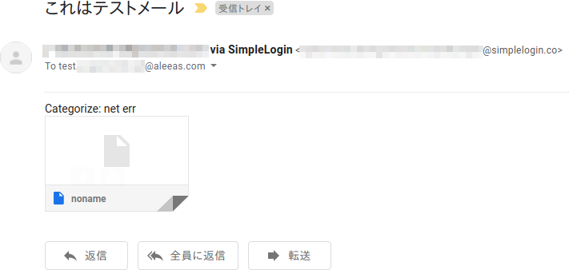
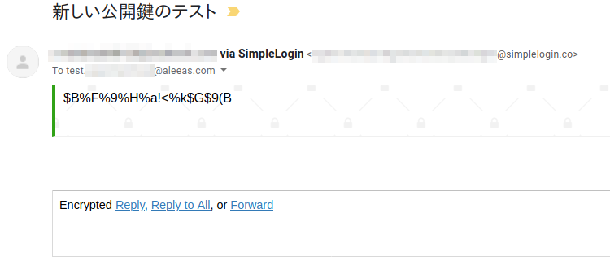
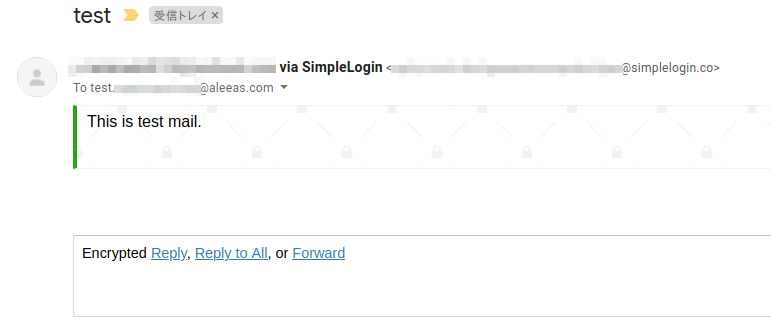

パスワードだけでなく、登録するメールアドレスもWebサービスごとに変えたいと思い、それを実現するサービスを調べてみました。  
自分ならどのサービス利用するか検討したので、せっかくなのでまとめておきます。  

## きっかけ

[Firefox Relay](https://relay.firefox.com/)の記事[^1]を見たことがきっかけです。  

実を言うと、これまでもGmailのエイリアス機能を使ってサービスごとにユニークなメールアドレスを登録していました。  
しかし、この方法には以下のような不満を抱いていました。  

- エイリアスを使ったメールアドレスを登録できないサービスがある
- 実際のメールアドレスがわかってしまう

Firefox Relayのように、実際のメールアドレスとは全く異なるメールアドレスを作り、届いたメールを普段遣いのメールアドレスに転送すれば、私の抱いている不満は解消されます。  

現時点（2020/8/29）では、Firefox Relayでは5つまでしかエイリアスを作れないため、似たようなサービスを探すことにしました。  

[^1]: [無料でアカウント作成時に使える捨てメアドを自動生成して本来のメールアドレスを守る「Firefox Relay」レビュー - GIGAZINE](https://gigazine.net/news/20200825-firefox-relay/)  

## 発見したサービス

- [SimpleLogin | Open-source email alias solution](https://simplelogin.io/)
- [Free, Open-source Anonymous Email Forwarding - AnonAddy](https://anonaddy.com/)

## 検討結果

SimpleLoginの方が以下の点で自分好み。  

- 有料プランの年会費が安い  
  SimpleLogin: 29.99ドル  
  AnonAddy (Pro): 36ドル （Liteは12ドル。ただしLiteでは使える機能がSimpleLoginに劣る。）  
- エイリアスに任意の単語を使える  
  登録先のサービス名を使えば、エイリアスの一覧を見たときにどのサービスに登録しているエイリアスか一目瞭然。  
  AnonAddyは任意の単語を使えないが、エイリアスの説明にサービス名を記入すれば一応識別可能。  
- Androidアプリがある
- エイリアスごとにPGPの有効/無効を切り替えられる  
  AnonAddyは転送先メールアドレスの単位でしか切り替えられない  
- Fromヘッダで送信元を確認できる  
  メール一覧を見れば送信元がわかる。AnonAddyは本文に挿入されるバナーを見なければ確認できない。  

ただ、SimpleLoginでは、PGPで暗号化されたメールを正しく復号できない場合がある、という現象を手元のPC環境で確認しています。  
Gmail宛にメールを転送しているので、GmailでPGPを利用するために[FlowCrypt](https://flowcrypt.com/)というアドオンを使用しているのですが、以下のように正しく復号できない場合があります。  

失敗例1  
  

失敗例2: あと一息。復号すると「テストメールです」というメッセージになる。[ProtonMail](https://protonmail.com/)でもこのような復号結果になった。  
  

成功例: 復号は成功していますが、英文は冠詞が抜けてますね。  
 

一方、AnonAddyはテストした範囲ではすべて正しく復号できていました。  

ちなみに、Android環境（[K-9 Mail](https://play.google.com/store/apps/details?id=com.fsck.k9&hl=ja)と[OpenKeychain](https://play.google.com/store/apps/details?id=org.sufficientlysecure.keychain&hl=ja)）ではPCで復号に失敗しているメールも正しく復号できました。  

せっかくなら暗号化を利用したかったので、私のPC環境でも問題なく動作するAnonAddyに少し気持ちが傾きかけました。  
ただ、暗号化にそこまで拘らなくてもいいし、他の点はSimpleLoginの方がよいと思っています。
私はSimpleLoginをメインで利用したいと思います。  

## おわりに

サービスごとにユニークなメールアドレスを作成できるサービスについて、自分にあったサービスを検討しました。SimpleLoginは無料プランだと機能が制限されるので、有料プランの契約を考えています。  
PGP暗号化は無料プランだと使えないのですが、登録後7日間は有料プランのトライアル期間だったので、その間に試しました。

2021/09/04 追記: 現在PC環境では、Thunderbirdを使って復号しています。Thunderbirdでは特に問題なく復号できています。  

