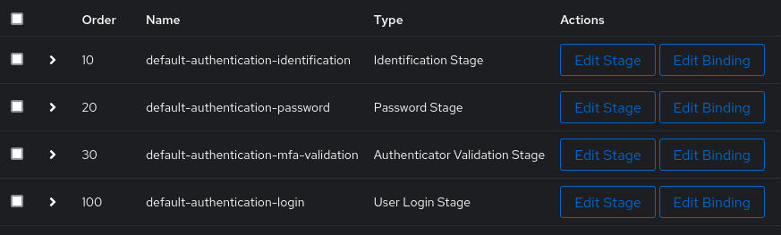
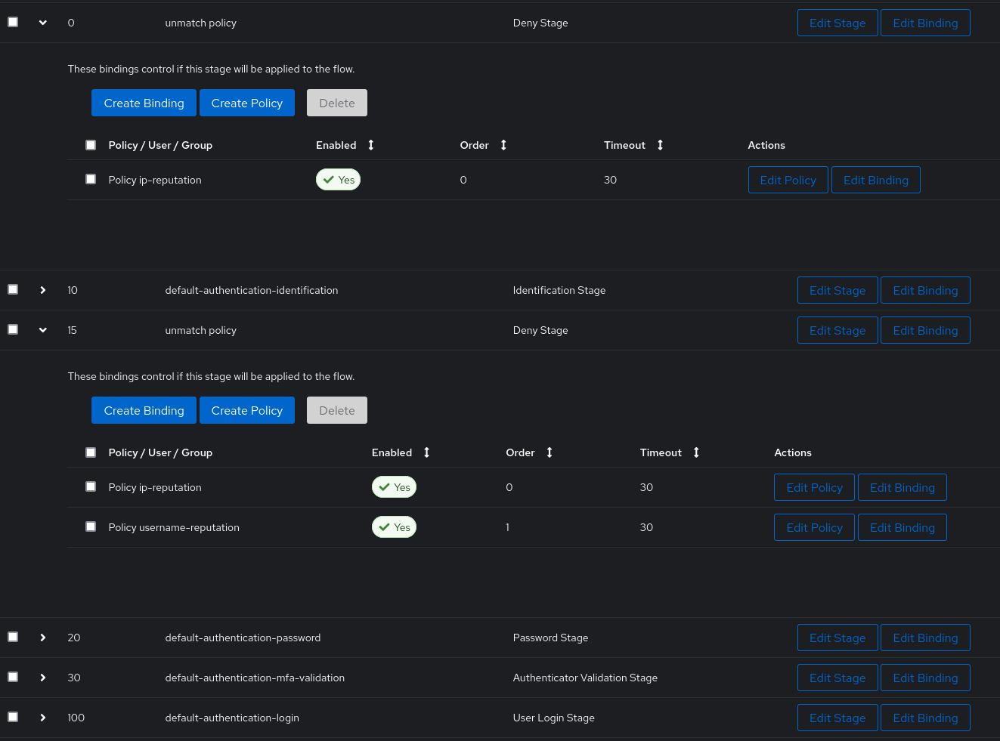

[Authentik](https://goauthentik.io/)はOSSのIDプロバイダです。  
Webページの前段に認証ページを設けたり、SAMLやOAuth2などでSSOを実現できたりします。

Authentikの機能を使ってfail2ban的な処理を実現したので、備忘録を兼ねてやり方をまとめました。

なお、本記事の内容を検証したバージョンは、`2022.6.3`です。

## デフォルトのログインフロー

ログインやログアウトなど、いくつかのフローがデフォルトで用意されています。  
ここではログインのみを紹介します。

次の図はデフォルトのログインフローです。  

簡単に説明すると、ユーザ名が有効であるか識別→認証（ユーザ名のパスワードと一致するか）→ （設定されている場合）多要素認証 → ログイン、という流れです。

この各段階を、Authentikでは **Stage** と呼びます。

また、各Stageにはポリシーやグループ、ユーザ名を設定できます。  
これを **Binding** と呼び、Bindingしたポリシーやグループなどにマッチする場合のみ、そのStageを実行する、という条件分岐を実現できます。

デフォルトのログインフローには、どのStageにもBinding設定がありません。

### デフォルトのログインフローの課題

デフォルトのログインフローでは、パスワードを5回間違えた場合のみ、ロックアウトされます。

ユーザ名については制限がなく、何回でも試行できてしまいます。

グローバルに公開するサービスで使う場合、ブルートフォース攻撃のリスクがあるので、デフォルトのログインフローをそのまま使うのは好ましくありません。

## Authentikのレピュテーション機能

Authentikにはレピュテーション機能が実装されています。  
レピュテーションは、接続元のIPアドレスとユーザ名のペアで保持されており、ログインに成功するたびにスコアが+1、失敗するたびに-1されるという仕組みになっています。

WebUIでは、次のように表示されます。私の環境における表示内容をもとに、IdentifierやIPの値を変えています。


| Identifier | IP | Score | Updated |
|------------|----|-------|---------|
| authentik member | 192.0.2.5 | 1 | 2022/6/12 16:35:05 |
| demo | 192.0.2.5 | 2 | 2022/6/23 7:01:47 |
| test | 203.0.113.100 | -4 | 2022/6/13 6:50:41 |
| user1 | 203.0.113.100 | 1 | 2022/6/13 6:45:23 |
| user1 | 192.0.2.10 | 1 | 2022/5/17 13:27:21 |
| user1 | 192.0.2.20 | 1 | 2022/6/12 6:51:19 |
| user1 | 192.0.2.5 | 1 | 2022/5/5 16:16:15 |
| user1 | 192.0.2.30 | 1 | 2022/5/11 7:17:29 |
| user1 | 192.0.2.40 | 1 | 2022/6/12 14:41:19 |


## レピュテーションを考慮したログインフロー

Bindingを利用して、レピュテーションスコアがしきい値を下回った場合フローを終了する、というログインフローを作りました。  

デフォルトのログインフローをベースに、以下の3つの変更を加えています。

1. 先頭にIPアドレスの[レピュテーションポリシー](https://goauthentik.io/docs/policies/#reputation-policy)をBindingした[Deny Stage](https://goauthentik.io/docs/flow/stages/deny)を追加  

2. `Identification Stage`で入力された値が有効でなかった場合、フローをはじめからやり直すような設定に変更  
  `Edit Binding` をクリック → `Invalid response action`の値を `RESTART restarts flow from the beginning.`にしています。

3. `Identification Stage`と`Password Stage`の間に、ユーザ名とIPアドレスのそれぞれのレピュテーションポリシーをBindingしたDeny Stageを追加

IPアドレスとユーザ名のレピュテーションポリシーでは、しきい値を-3にしています。

これらによって、レピュテーションスコアの低いIPアドレスからの認証試行と、レピュテーションスコアの低いユーザ名への認証試行をそれぞれ拒否しています。  
3つ目の変更点について、ここでのレピュテーションポリシーはユーザ名のみでよいかもしれません。

なお、Stageにポリシーを適用する方法は以下のとおりです。

1. ポリシーを適用するStageの折りたたみを展開  
  Stageの左側にある▶をクリックします。（上の図では折りたたまれているStageが▶、開かれているStageが▼になっています）

2. 展開された部分にある`Create Binding`をクリックし、適用するポリシーをプルダウンから選択  
  ポリシーをまだ作成していない場合は、`Create Binding`ではなく`Create Policy`をクリックしてポリシーを作成します。

## わかっていないこと

- レピュテーションでIPアドレスとユーザ名のどちらにもチェックを入れられるが、その時の判定がORとANDのどちらなのかわからない

- レピュテーションの有効期限  
一般的には、一定時間経過したら再度ログイン試行できるようにするという実装になっていることが多い。  
私の環境では1ヶ月前のレピュテーションも未だ残っている。  
時間制限や削除についてのissue[^1]は見つけたが、すでに実装されているのかどうかまでは調べていない。  

[^1]: [fail2ban-like setup · Issue #974 · goauthentik/authentik](https://github.com/goauthentik/authentik/issues/974)

Authentikはドキュメントに細かい仕様が書かれていないため、上記を把握するためにはソースコードを読む必要がありそうに感じています。

## リスク

レピュテーションスコアの低いユーザ名への認証試行を拒否するようにした意図は、複数クライアントからのブルートフォース攻撃とリバースブルートフォース攻撃への対策なのですが、これらの攻撃によってレピュテーションスコアの下がったユーザ名の正規ユーザが新たにログインできなくなる可能性があります。  
これは、[わかっていないこと](#わかっていないこと)に書いたレピュテーションの有効期限の懸念によるものです。  

APIを使ってレピュテーションスコアを監視・リセットする仕組みでも作ろうかと考えています。

## おわりに

インターネットから自宅のサーバに立てたサービスにアクセスできるようにするにあたって、Authentikを使い始めました。（参考: [Cloudflare、Traefik、Authentikを使った自宅Dockerサーバ]()）

ホスト上でfail2banを使うことも考えましたが、Authentikの機能でも実現できそうだったので、まずはこちらで試してみました。

スコアが低い場合にCAPTCHAを設けるなど、レピュテーションは他にも活用できそうです。
