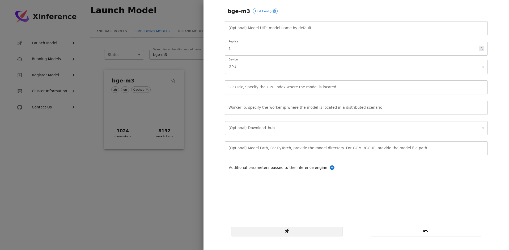

ローカル LLM を使って[microsoft/graphrag](https://github.com/microsoft/graphrag)を動作させることに成功したのでメモ。

## 結論

以下のモデルを使うことで、インデックス作成処理が成功した。

- LLM モデル: [hugging-quants/Meta-Llama-3.1-8B-Instruct-AWQ-INT4 · Hugging Face](https://huggingface.co/hugging-quants/Meta-Llama-3.1-8B-Instruct-AWQ-INT4)
  - サービングエンジン: [vllm-project/vllm](https://github.com/vllm-project/vllm)
- Embedding モデル: [BAAI/bge-m3 · Hugging Face](https://huggingface.co/BAAI/bge-m3)
  - サービングエンジン: [xorbitsai/inference](https://github.com/xorbitsai/inference)

ローカルサーチとグローバルサーチは[Qwen/Qwen2-1.5B-Instruct · Hugging Face](https://huggingface.co/Qwen/Qwen2-1.5B-Instruct)で試した。  

## 環境

GPU: NVIDIA GeForce RTX 4060 Ti (VRAM 16GB)

Python

```bash
$ python -V
Python 3.11.6
```

GraphRAG: 試行錯誤した結果、git リポジトリからインストールしたバージョンとなっているが、pip でインストールしたバージョンでいいと思う。

```bash
$ pip list | grep graphrag
graphrag                  0.3.3.dev23
$ pip freeze | grep graphrag
graphrag @ git+https://github.com/microsoft/graphrag@27c5468a8b6277b7eb2f6e06a701aad55fff50f7
```

vLLM: [vllm/vllm-openai - Docker Image | Docker Hub](https://hub.docker.com/r/vllm/vllm-openai) v0.6.0 (digest から特定)

```bash
$ docker image ls --digests | grep vllm
vllm/vllm-openai                                    latest                                     sha256:072427aa6f95c74782a9bc3fe1d1fcd1e1aa3fe47b317584ea2181c549ad2de8   714424fc682c   5 days ago      9.72GB
```

Xinference: [xprobe/xinference - Docker Image | Docker Hub](https://hub.docker.com/r/xprobe/xinference)

```bash
$ docker exec xinference xinference --version
xinference, version 0.14.3
```

## セットアップ

### GraphRAG

GraphRAG のセットアップは割愛。  
以下のドキュメントに従った。

[Get Started](https://microsoft.github.io/graphrag/posts/get_started/)

git リポジトリからインストールする場合は、以下を実行する。

```bash
$ pip install git+https://github.com/microsoft/graphrag
```

### vLLM

HuggingFace でトークンを取得し、`.env` に記述しておく。

```bash
$ cd /path/to/vllm
$ mkdir cache
$ cat .env
HF_TOKEN=<snip>
PYTORCH_CUDA_ALLOC_CONF=expandable_segments:True
VLLM_ALLOW_LONG_MAX_MODEL_LEN=1

$ docker run --runtime nvidia --gpus all --rm \
  --name vllm \
  -v $PWD/cache:/root/.cache/huggingface \
  --env-file .env \
  -p 18000:8000 \
  --ipc=host \
  vllm/vllm-openai:latest \
  --model hugging-quants/Meta-Llama-3.1-8B-Instruct-AWQ-INT4 \
  -q awq \
  --max-model-len 60400  # kv-storeの制限に関するエラーが発生したため、max-model-lenを60400にした
```

### Xinference

```bash
$ cd /path/to/xinference
$ mkdir data
$ cat .env
HF_TOKEN=<snip>
PYTORCH_CUDA_ALLOC_CONF=expandable_segments:True
XINFERENCE_HOME=/data

$ docker run --rm --name xinference -d --gpus all \
  -p 9997:9997 \
  -v $PWD/data/:/data \
  --env-file $PWD/.env \
  xprobe/xinference:latest \
  xinference-local -H 0.0.0.0
```

ブラウザで `http://localhost:9997` にアクセス。

`Launch Model` -> `EMBEDDING MODELS` -> `bge-m3` -> `Launch` とクリック。

パラメータは以下の通り。



ただし、私の環境だと llama3 と bge-m3 を同時に動かせなかった。  
そのため、インデックス作成時は必要とされる方のみ動かしていた。詳細は後述。

### 設定ファイルの編集

起動したモデルと URL に書き換える。

- `llm.model`
- `llm.api_base`
- `embeddings.llm.model`
- `embeddings.llm.api_base`

私の場合、チャンクサイズとオーバーラップの値も変更した。

```yaml
encoding_model: cl100k_base
skip_workflows: []
llm:
  api_key: ${GRAPHRAG_API_KEY}
  type: openai_chat # or azure_openai_chat
  # model: gpt-4-turbo-preview
  model: hugging-quants/Meta-Llama-3.1-8B-Instruct-AWQ-INT4  # vllm
  model_supports_json: true # recommended if this is available for your model.
  # max_tokens: 4000
  # request_timeout: 180.0
  request_timeout: 600.0
  # api_base: https://<instance>.openai.azure.com
  api_base: http://localhost:18000/v1  # vllm
  # api_version: 2024-02-15-preview
  # organization: <organization_id>
  # deployment_name: <azure_model_deployment_name>
  # tokens_per_minute: 150_000 # set a leaky bucket throttle
  # requests_per_minute: 10_000 # set a leaky bucket throttle
  # max_retries: 10
  # max_retry_wait: 10.0
  # sleep_on_rate_limit_recommendation: true # whether to sleep when azure suggests wait-times
  # concurrent_requests: 25 # the number of parallel inflight requests that may be made
  # temperature: 0 # temperature for sampling
  # top_p: 1 # top-p sampling
  # n: 1 # Number of completions to generate

parallelization:
  stagger: 0.3
  # num_threads: 50 # the number of threads to use for parallel processing

async_mode: threaded # or asyncio

embeddings:
  ## parallelization: override the global parallelization settings for embeddings
  async_mode: threaded # or asyncio
  # target: required # or all
  llm:
    api_key: ${GRAPHRAG_API_KEY}
    type: openai_embedding # or azure_openai_embedding
    model: bge-m3  # xinference
    # api_base: https://<instance>.openai.azure.com
    api_base: http://localhost:9997/v1  # xinference
    # api_version: 2024-02-15-preview
    # organization: <organization_id>
    # deployment_name: <azure_model_deployment_name>
    # tokens_per_minute: 150_000 # set a leaky bucket throttle
    # requests_per_minute: 10_000 # set a leaky bucket throttle
    # max_retries: 10
    # max_retry_wait: 10.0
    # sleep_on_rate_limit_recommendation: true # whether to sleep when azure suggests wait-times
    # concurrent_requests: 25 # the number of parallel inflight requests that may be made
    # batch_size: 16 # the number of documents to send in a single request
    # batch_max_tokens: 8191 # the maximum number of tokens to send in a single request


chunks:
  # size: 1200
  # overlap: 100
  size: 512
  overlap: 128
  group_by_columns: [id] # by default, we don't allow chunks to cross documents

input:
  type: file # or blob
  file_type: text # or csv
  base_dir: "input"
  file_encoding: utf-8
  file_pattern: ".*\\.txt$"

cache:
  type: file # or blob
  base_dir: "cache"
  # connection_string: <azure_blob_storage_connection_string>
  # container_name: <azure_blob_storage_container_name>

storage:
  type: file # or blob
  base_dir: "output/${timestamp}/artifacts"
  # connection_string: <azure_blob_storage_connection_string>
  # container_name: <azure_blob_storage_container_name>

reporting:
  type: file # or console, blob
  base_dir: "output/${timestamp}/reports"
  # connection_string: <azure_blob_storage_connection_string>
  # container_name: <azure_blob_storage_container_name>

entity_extraction:
  ## llm: override the global llm settings for this task
  ## parallelization: override the global parallelization settings for this task
  ## async_mode: override the global async_mode settings for this task
  prompt: "prompts/entity_extraction.txt"
  entity_types: [organization,person,geo,event]
  max_gleanings: 1

summarize_descriptions:
  ## llm: override the global llm settings for this task
  ## parallelization: override the global parallelization settings for this task
  ## async_mode: override the global async_mode settings for this task
  prompt: "prompts/summarize_descriptions.txt"
  max_length: 500

claim_extraction:
  ## llm: override the global llm settings for this task
  ## parallelization: override the global parallelization settings for this task
  ## async_mode: override the global async_mode settings for this task
  # enabled: true
  prompt: "prompts/claim_extraction.txt"
  description: "Any claims or facts that could be relevant to information discovery."
  max_gleanings: 1

community_reports:
  ## llm: override the global llm settings for this task
  ## parallelization: override the global parallelization settings for this task
  ## async_mode: override the global async_mode settings for this task
  prompt: "prompts/community_report.txt"
  max_length: 2000
  max_input_length: 8000

cluster_graph:
  max_cluster_size: 10

embed_graph:
  enabled: false # if true, will generate node2vec embeddings for nodes
  # num_walks: 10
  # walk_length: 40
  # window_size: 2
  # iterations: 3
  # random_seed: 597832

umap:
  enabled: false # if true, will generate UMAP embeddings for nodes

snapshots:
  graphml: true
  raw_entities: false
  top_level_nodes: false

local_search:
  # text_unit_prop: 0.5
  # community_prop: 0.1
  # conversation_history_max_turns: 5
  # top_k_mapped_entities: 10
  # top_k_relationships: 10
  # llm_temperature: 0 # temperature for sampling
  # llm_top_p: 1 # top-p sampling
  # llm_n: 1 # Number of completions to generate
  # max_tokens: 12000

global_search:
  # llm_temperature: 0 # temperature for sampling
  # llm_top_p: 1 # top-p sampling
  # llm_n: 1 # Number of completions to generate
  # max_tokens: 12000
  # data_max_tokens: 12000
  # map_max_tokens: 1000
  # reduce_max_tokens: 2000
  # concurrency: 32
```

## プロンプトチューニング

以下のドキュメントに書いてあった minimal configuration なコマンドを実行した。

[Prompt Tuning ⚙️](https://microsoft.github.io/graphrag/posts/prompt_tuning/auto_prompt_tuning/)

```bash
$ cd /path/to/graphrag/ragtest
$ python -m graphrag.prompt_tune --root . --config settings.yaml --no-entity-types
```

## インデックス作成

ここでは、私がインデックス作成に成功した際のコマンド実行について、順を追って記述する。

前述の通り、私の環境では llama3 と bge-m3 を同時に動かせなかったので、はじめは llama3 のみを動かしている状態で以下のコマンドを実行した。

```bash
$ cd /path/to/graphrag/ragtest
# Python仮想環境のアクティベートは割愛
$ python -m graphrag.index --root .
```

上記のコマンドは、Embedding が必要な処理に達すると、エラーとなり失敗した。

そこで vLLM を止めて、[Xinferenceでbge-m3を動かした](#xinference)。
xinference で bge-m3 を起動後は、インデックス作成をエラーとなった段階から再開した。

コマンドは以下の通り。

```bash
$ docker stop vllm
# 先ほどのインデックス作成コマンドに関するディレクトリ名（yyyy-mm-dd-HHMMSS）を確認する
$ ls output
# xinferenceでEmbeddingモデルを動かしている状態で、先ほどのコマンドに --resume オプションを付けて実行する
# --resumeの値はlsコマンドで確認した値に置き換える
$ python -m graphrag.index --root . --resume 20240910-123456
```

Embedding 処理が終わると、再度 LLM モデルを使った処理が始まる。  
上記を標準出力から確認した段階で、xinference を止めて vLLM を再度起動させた。

```bash
$ docker stop xinference
# vLLMの起動コマンドはセットアップに記述したものなので割愛
```

そのまま放置していたらインデックス作成処理が完了していた。

## ローカルサーチ

ローカルサーチは LLM モデルと Embedding モデルを同時に動かす必要がある。

そのため、ローカルサーチ実行時は llama3 ではなく、[Qwen/Qwen2-1.5B-Instruct](https://huggingface.co/Qwen/Qwen2-1.5B-Instruct)を使用している。

## うまくいかなかったこと

- LLM モデルを Xinference で動かしてインデックス作成

  Xinference はインデックス作成時の大量のクエリを捌けずエラーとなり失敗していた。  
  vLLM は複数クエリの処理に長けており、安定していることがわかった。  
  その代わり、Ollama や Xinference と比べてメモリを多く使用する印象。

- Gemma によるインデックス作成

  bge-m3 と同時に動かすためにサイズの小さいモデルを試したが、途中でエラーとなった。  
  試したモデルは [google/gemma-2-2b](https://huggingface.co/google/gemma-2-2b)、[google/gemma-2-2b-it](https://huggingface.co/google/gemma-2-2b-it)、[Qwen/Qwen2-1.5B-Instruct](https://huggingface.co/Qwen/Qwen2-1.5B-Instruct)。  
  エラー内容は以下の issue などで言われている、 create_base_entity_graph 処理での `Columns must be same length as key` というエラー。  
  [❌ Errors in create_base_entity_graph · Issue #437 · microsoft/graphrag](https://github.com/microsoft/graphrag/issues/437)

## 所感

- コンテキストサイズが大きいモデルを使うとよい。

  コンテキストサイズを超えている、というエラーがインデックス作成やローカルサーチで発生した。  
  対象データによる可能性が高いが、GraphRAG にはコンテキストサイズが大きいモデルが向いていそう。  

- GraphRAG のインデックス作成のような同時に複数クエリが発生する処理には vLLM が向いている。  

- VRAM 16GB では足りない。  
