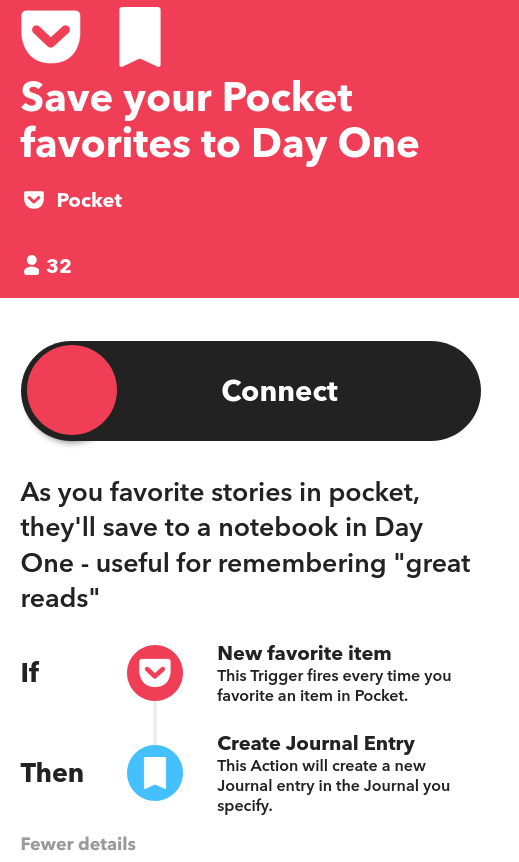
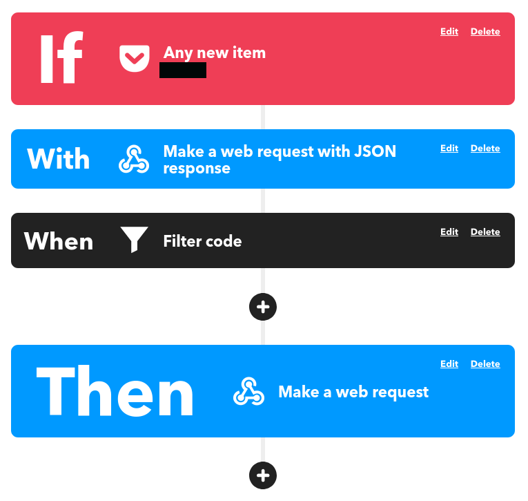
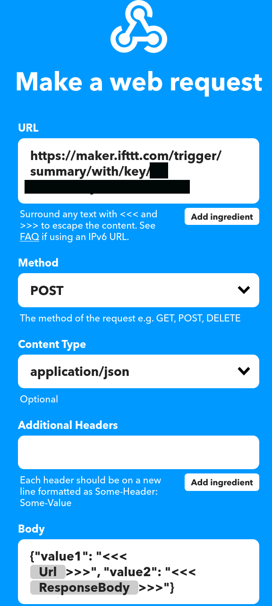
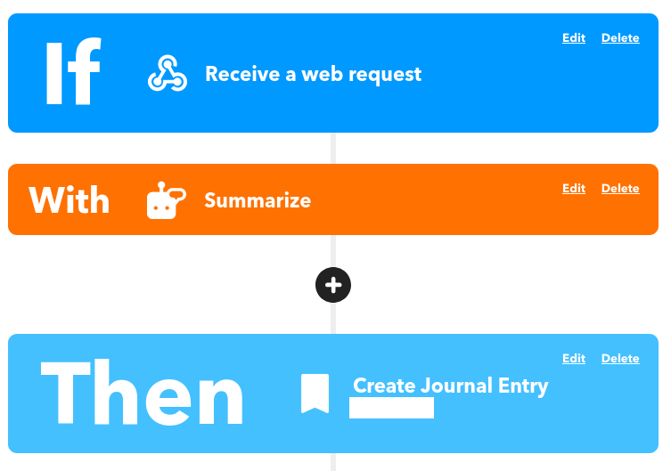
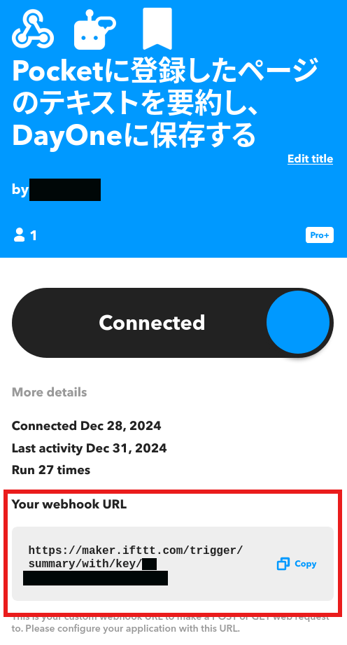

[IFTTT](https://ifttt.com/)は無料プランが見直されたタイミング[^1]で有料プランに切り替えた。

[^1]: [無償版“IFTTT”で利用可能なアプレットは3つまでに ～超過分は10月8日にアーカイブ - 窓の杜](https://forest.watch.impress.co.jp/docs/news/1278901.html)

当時は期間限定で課金額を自分で決められたので、設定できる最低金額でずっと利用させてもらっている[^2]。

[^2]: 履歴を見ると 2024 年 1 月まで $1.99/month で、2024 年 2 月からは $3.99/month になっている。

プランは Pro+ なので、IFTTT の AI サービスが使える。  
いつの間にか使えるようになっていたこのサービスをどこかで使いたいと考えていた。

そこで、以前からライフログの一環として[Pocket](https://getpocket.com/ja/about)に保存した Web ページを[Day One](https://dayoneapp.com/web/)に記録しているため、これに組み込むことにした。

## やりたいこと

Pocket に保存した Web ページの内容を IFTTT の AI Summarizer で要約して、Day One に保存する。  

既存のアプレットは以下のようなトリガー（下図の If の部分）とアクション（下図の Then の部分）になっているので、間に AI Summarizer が入るイメージ。



ただし、トリガーとした Pocket からは要約に十分な Web ページの情報を得られないため、少し工夫した。

## 作ったもの

- Web ページのテキストを取得する Cloudflare Workers アプリ
- 上記 Cloudflare Workers アプリを利用して Pocket で保存した Web ページのテキストを取得するアプレット
- 上記アプレットで得たテキストを AI Summarizer で要約して Day One に記録するアプレット

## Cloudflare Workers アプリ

以前作った Cloudflare Workers アプリをベースにした。  

[](https://github.com/bridge-y/webscraper)

以下のようにコンテンツを取得したい URL をパラメータにセットすることで、テキストを JSON で得られる。  

```bash
$ curl https://<your worker domain>/?url=<URL you want to retrieve content from>
{"text": "hoge"}
```

## アプレットその1



このアプレットは Pocket への保存をトリガーとして、以下の処理を実行する。

- `Make a web request with JSON response`: Pocket に保存した URL を Cloudflare Workers アプリに投げてテキストを JSON 形式で取得する
- `Filter code`: JSON からテキストを抽出し、アクションに設定している `Make a web request` のボディに以下の情報を JSON 形式で設定する
  - Web ページのタイトル
  - Web ページの URL
  - Cloudflare Workers で取得したテキスト

Filter code に設定しているコードは以下の通り。

```javascript
let payload = JSON.parse(MakerWebhooks.makeWebRequestQueryJson[0].ResponseBody)
let text = `${payload.text}`

if (text === "") {
  MakerWebhooks.makeWebRequest.skip("テキストが取得できなかったため")
}

else {
  MakerWebhooks.makeWebRequest.setBody(
    JSON.stringify({"value1": Pocket.newItemAddedPocket.Title, "value2": Pocket.newItemAddedPocket.Url, "value3": text})
  )
}
```

アクションに設定している `Make a web request` には、アプレットその 2 の URL を設定する。  
Method は `POST` とし、Content Type は `application/json` を選ぶ。  
Body は `Filter code` の処理で設定されるため、ここは適当な内容を入れておけばよい。(画像で設定されている Body は試行錯誤していたときの名残)



## アプレットその2



このアプレットは、HTTP POST をトリガーとして、以下の処理を実行する。

- `Summarize`: HTTP リクエストボディの `value3` を AI Summarizer で要約する
- `Create Journal Entry`: HTTP リクエストボディの `value1`, `value2`, AI Summarizer の要約結果を Day One に保存する
  - `value1`: アプレットその 1 で、Pocket に保存した Web ページのタイトルを設定している
  - `value2`: アプレットその 1 で、Pocket に保存した Web ページの URL を設定している

`Receive a web request` をトリガーに設定したアプレットを保存すると、再度その保存したアプレットにアクセスしたときに Webnook URL が表示される。  



アプレットその 1 のアクション `Make a web request` では、この URL を設定する。

## 応用アイディア

アプレットその 2 のアクションで保存する先を LLM に読み込ませやすいナレッジベースにすると、LLM に質問できるようになるので面白そう。  

例えば、Zettelkasten の Git リポジトリとか。  

IFTTT の既存のアクションでは実現できないので、Web API で Zettelkasten の Git リポジトリに Push するようなアプリを作る必要があるが。

[Notion]([Notion](https://www.notion.com/ja/explore)) の Web クリップで Notion に保存すれば Notion AI で同じようなことができるが、無料プランだと回数制限があって使いにくかった。

別途[ArchiveBox](https://archivebox.io/)で取得した Web ページを Zettelkasten の Git リポジトリに Push するようにしてもよさそう[^3]。  

[^3]: Pocket に保存した Web ページを ArchiveBox で保存する仕組みは以前に作って運用していたのだが、いつの間にか動かなくなっていた。

## おわりに

これまで使っていなかった IFTTT の AI 機能を活用してみた。  

Day One はライフログの保存先として 6 年近く使っているが、だんだんナレッジベースっぽい使い方になってきている。  
ナレッジベースとするには検索が弱いので、より適した保存先を検討したい。
