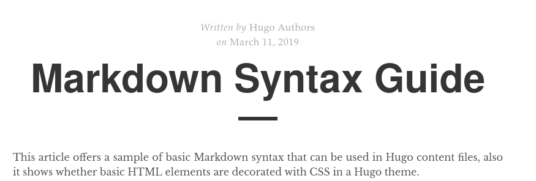
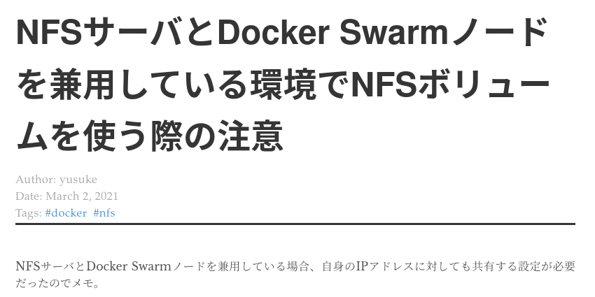

`bridgey.dev`を取得したので、[Netlify](https://www.netlify.com/)のドメインで運用していたブログのドメインを移行した。
ついでに、ブログ周りの設定も変更したので、変更点をまとめておく。

## ホスト先をCloudflare Pagesに変更

今までNetlifyにホストしていたが、新ドメインでは[Cloudflare Pages](https://pages.cloudflare.com/)を使ってみた。
旧ドメインへのアクセスを新ドメインにリダイレクトしたいので、Netlifyにホストしているブログは残しておく。

Cloudflare Pagesの設定はとても簡単だった。GitHubリポジトリと連携→フレームワークでHugoを選択→環境変数を設定→デプロイ、という流れ。

環境変数では、`HUGO_VERSION`にHugoのバージョンを指定した。

ブログにはサブドメインを割り当てることにしたので、カスタムドメインの設定で表示されたCNAMEレコードを、ドメインを取得したレジストラに設定した。

## URLパスを英語に変更

いままでエントリを日本語のパスにしていたが、URLエンコードされると見栄えがよくないので英語に変更することにした。

パスを英語にするために、以下のような`slug`を各エントリに追記した。

```text
---
title: "jqコマンドで値をキーとしたオブジェクトに整形する方法"
slug: how-to-convert-value-to-key-using-jq
```

## 旧ドメインへのアクセスを新ドメインにリダイレクトする設定

エントリのパスを変えてしまったので、旧ドメインのエントリへのアクセスを新ドメインのエントリに正しくリダイレクトするためには、エントリごとにリダイレクト設定を記述する必要がある。

すべて手作業で書くのは面倒なので、[jqコマンド](https://stedolan.github.io/jq/)と[yjコマンド](https://github.com/sclevine/yj)を利用した。

1. `旧ドメインの日本語URL<TAB>新ドメインの英語URL`という構造のTSVファイルを作る  
  下記のコマンドでエントリのpathやpermalinkを出力し、スプレッドシートにペーストして作った。  
  pathでソートし、旧ドメインと新ドメインのpermalinkそれぞれをスプレッドシートの列に貼る。
  
  ```bash
  hugo list all
  ```
  
  エントリ以外へのアクセスも新ドメインにリダイレクトしたいので、最後の行に`https://y-stdout.netlify.app/*<TAB>https://blog.bridgey.dev/:splat`を追記した。
  
2. TSVをTOMLに変換する  
  下記のコマンドで旧ドメインから新ドメインへのリダイレクト設定を`netlify.toml`に追記した。  
  `<tsv>`は、1で作成したtsvファイルのパスを入れる。  
  
  ```bash
  jq -R  'inputs | split("\t") | {from:.[0], to:.[1], status:301, force:true}' <tsv> | jq -s '{redirects:.}' | yj -jt >> netlify.toml
  ```

3. 旧ドメインのブログにリダイレクト設定を反映  
  Netlifyに連携していたブログのリポジトリに`netlify.toml`の変更を反映した。このあと、旧ドメインのエントリにアクセスしたところ、期待通り新ドメインのエントリにリダイレクトされた。

## テーマの変更

よりシンプルにしたかったので、テーマを[Beautifulhugo](https://themes.gohugo.io/beautifulhugo/)から[Tale](https://themes.gohugo.io/tale-hugo/)に変更した。
TOCやエントリ情報の位置を変更したり、CSSを追加したりといくつか手を加えている。

Taleのデモページと本ブログのタイトル付近の違いは以下の通り。

- **Taleのデモページ**  



- **本ブログ**  



今後も一部に手を加えたり、テーマ自体を変えるかもしれない。

## おわりに

ドメイン取得やCloudflare Pagesの利用など、やってみたい・試してみたいと思っていたことを複数消化できた。

今回の過程で久しぶりに見た過去のエントリによると、どうやらこのブログでは趣味や読んだ本なども投稿するつもりだったようなので、そろそろそのネタのエントリを書きたい。

## 参考

- [Deploy a Hugo site · Cloudflare Pages docs](https://developers.cloudflare.com/pages/how-to/deploy-a-hugo-site)
- [Redirects and rewrites | Netlify Docs](https://docs.netlify.com/routing/redirects/)

