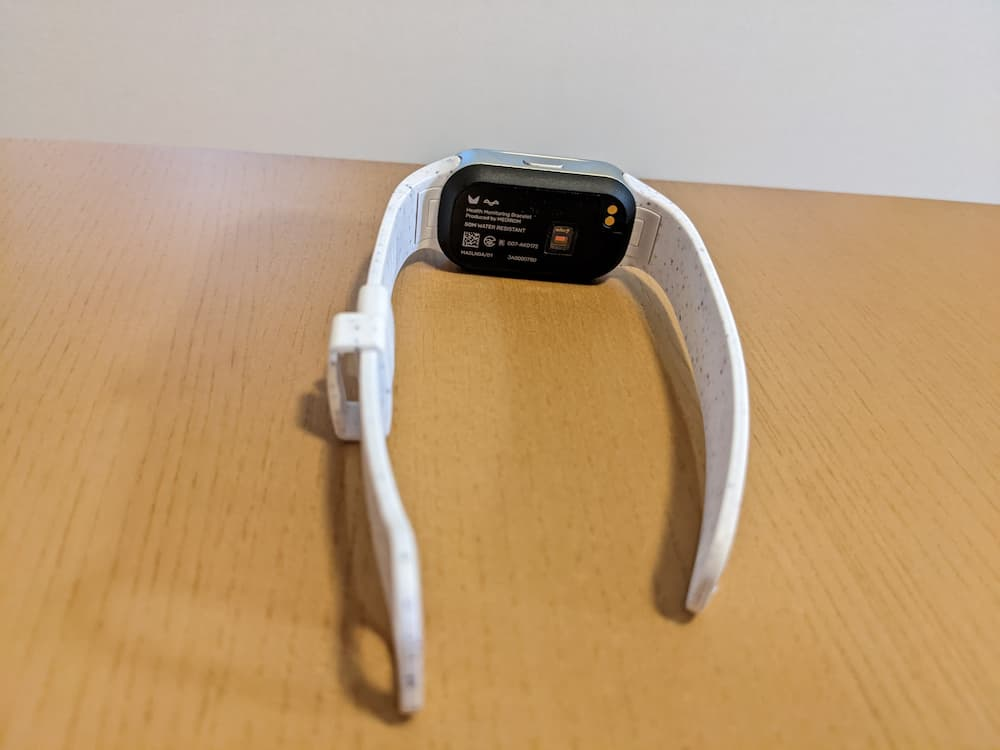
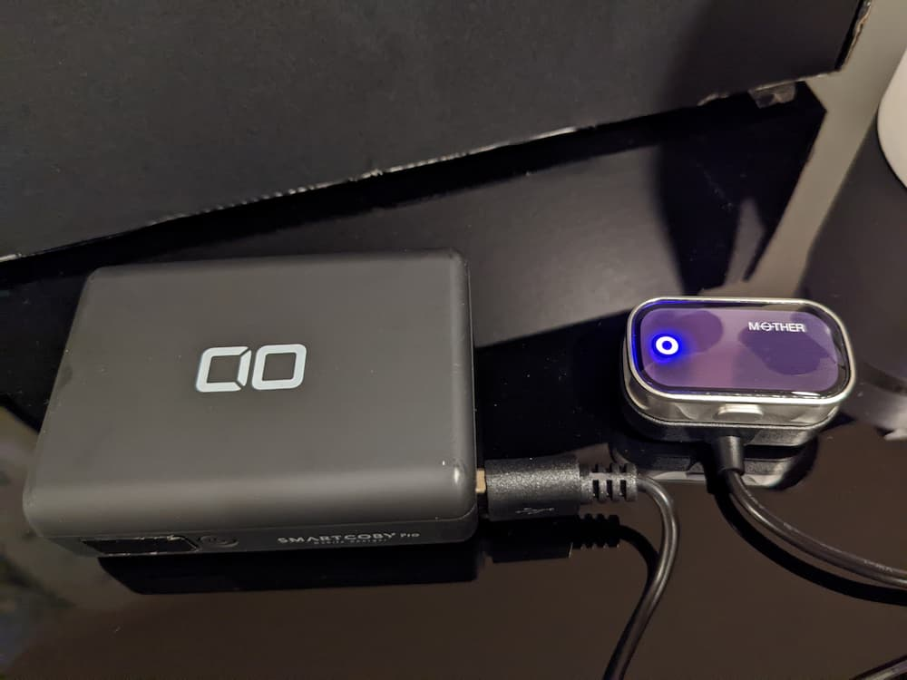

[MOTHER Bracelet](https://mother-bracelet.com/)は充電不要かつ生活防水で24/365着用可能であることを特徴とした活動量計である。  
歩数、睡眠、体表温、心拍数、消費カロリーを常時計測できる。  
充電不要というのは、充電ケーブルを使う必要がない、という意味で、着用中に温度差と太陽光で発電することで稼働する。  

私がMOTHER Braceletを知ったのは2020年のCESに関するニュースだった。  
その頃はリストバンド型やリング型で稼働時間が長い活動量計を探していたので、発売されたら絶対に買おうと思ったことを覚えている。  
ただ、その後は特に動向をウォッチしていなかったため、クラウドファンディングの開始を知ったのはMakuakeからのメールである。  

## セットアップ

そんな経緯で購入したMOTHER Braceletだが、今週ようやく手元に届いた。  



裏側はこんな感じ。  

バンドはボタンを押しながら引っ張ることで外すことができるのだが、私には少し難しかった。  
爪では押すことができなかったので、先の尖ったものを使って押した。  

充電不要ではあるが、消費電力が発電量を上回った場合のために、充電器も同梱されている。  
特に、初回起動の消費電力は大きいようで、説明書にはまず充電器で充電するよう書かれている。

写真は初回起動に向けて充電している様子。  

満充電に掛かる時間は1〜2時間程度。

スマートフォンとのペアリング周りでは少々苦戦した。  
その際のトラブルと知見は以下の通り。

### Bluetoothのペアリング画面が2回表示される

ペアリングでは、スマートフォンアプリでMOTHER BraceletのLEDの点滅の色を入力する。  
入力が完了すると、スマートフォンの画面にBluetoothのペアリング画面が表示されるのだが、私の場合はその画面でペアリングを許可した直後に再度ペアリング画面が表示されるという現象が発生した。  
（私はPixel 5aを使っている。）  

2度目の画面ではキャンセルをタップしても問題なかった。

### 同期が成功しない

説明書の記載通りペアリングしたが、デバイスとの同期に成功しなかった。  
また、説明書に記載されている同期に失敗する場合の対応手順を実施しても同期が成功しなかった。  

この問題は、下記のような手順を踏むことで解決した。

ペアリング解除 → MOTHER Braceletのリセット → スマートフォンでアプリのデータを完全削除 → アプリで再度ログイン → ペアリング

### MOTHER Braceletと接続できない

スマートフォンアプリを起動すると、画面上部に「接続処理中」という文字が表示される。  
しばらくすると「接続済み」となるのだが、何度起動しても接続できず「未接続」と表示される場合があった。

この問題、MOTHER Braceletを一度シャットダウンしてから再度起動することで解決した。

## おわりに

届いてから1日着用してみた。  
着用したまま入浴もしたが、特に故障の心配はなさそう。  

ちなみに、説明書では運動や入浴で汗をかいた場合は水で洗うことが推奨されている。  
入浴後に手間が増えるのと、シャワーヘッドなどにぶつけるのを避けるために、次からは外して入浴するかもしれない。  

また、アプリで計測された歩数は、実際よりも多く表示されている気がしている。  
他の歩数計と比較したわけではないので、これはあくまで私の感想。  
腕を大きく振った場合歩数とカウントされる場合がある、と説明書に書かれているので、そのせいかもしれない。

もう少し長い期間使ってみて、また使用感などを記したい。
