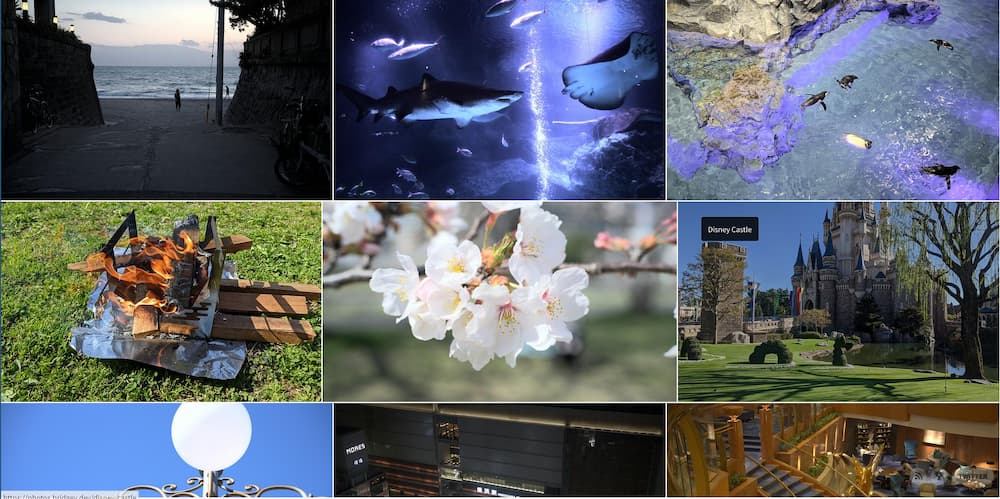

[Cloudflare Pages](https://pages.cloudflare.com/)と[photo-stream](https://github.com/waschinski/photo-stream)というOSSを使ってフォトギャラリーを作りました。

[photos.bridgey.dev](https://photos.bridgey.dev/)  

[去年SIGMA fpを買った]()ので、定期的に写真を撮っています。
撮影した写真を公開したい気持ちがだんだん強くなってきたというのが、フォトギャラリーを作った理由です。

利用するツールを探している際、今回利用しているphoto-streamをDocker向けに改良したリポジトリ[^1]を見つけたので、Dockerを使いたい場合はこちらを利用すると良いかもしれません。

[^1]: [waschinski/photo-stream: Self-hosted, super simple photo stream](https://github.com/waschinski/photo-stream)

photo-streamはRSSが使えるので、IFTTTと連携して写真を投稿したらTwitterに通知するようにしようかと考えています。
