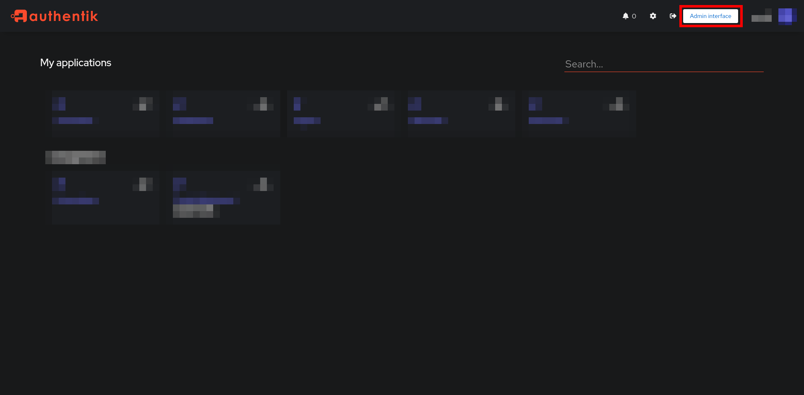
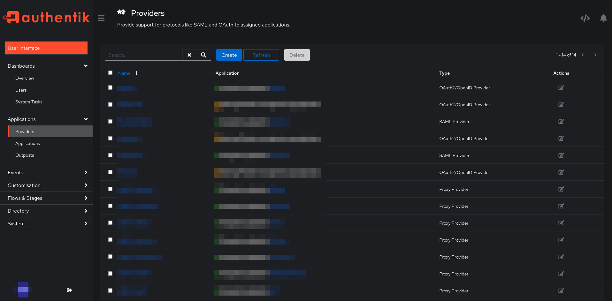
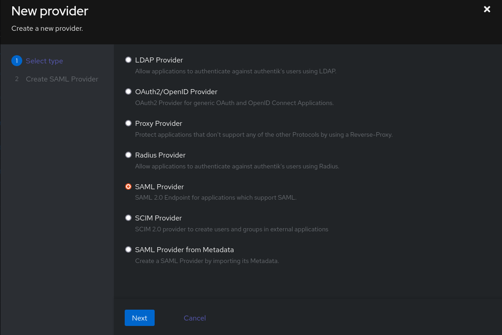
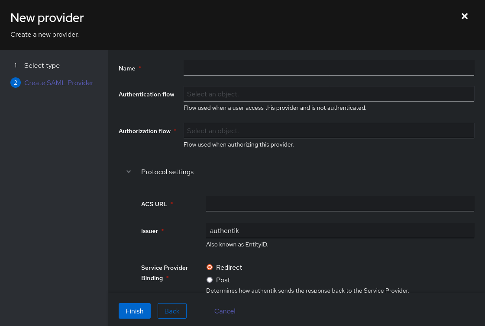
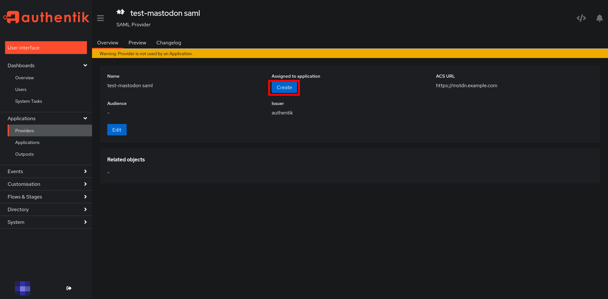
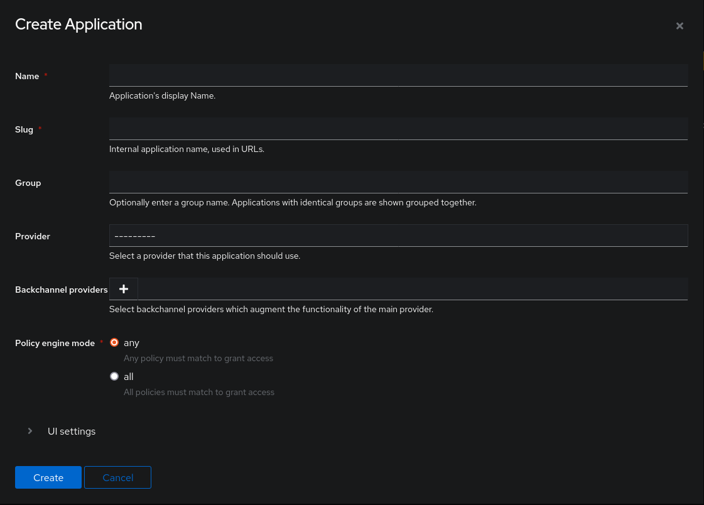
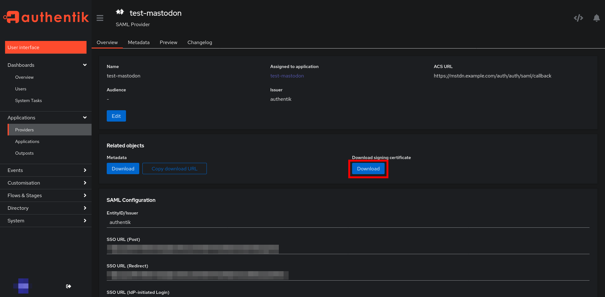
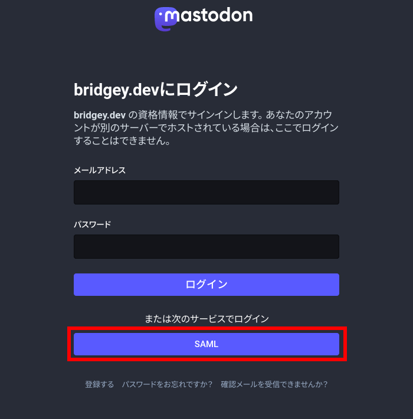
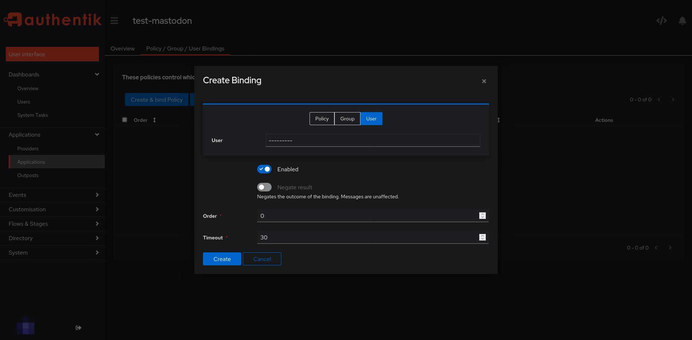

日常や思考のスナップショットを記録する場所として、Twitter を使っている。  
Twitter の最近の動向からバックアップが欲しくなったため、自分用の Mastodon インスタンスを立てた。  
これからは Twitter の利用を継続しつつ、Mastodon にも投稿する予定。

## 概要

[bridgey / docker-mastodon · GitLab](https://gitlab.com/_bridgey/docker-mastodon)

- [Docker](https://www.docker.com/) を利用
- [Authentik](https://goauthentik.io/) を利用した SAML 認証
  - 本記事の執筆時のバージョンは `2023.6.1`
- リバースプロキシに [Traefik](https://github.com/traefik/traefik) を利用（本記事では扱わない）
  - 別の Compose ファイルで管理している
- ハンドル名に利用するドメインと、Mastodon をホストするドメインを変えている

本記事では、上記に記した私のリポジトリに基づくセットアップ方法を記述する。  
私は別途設定した Traefik も利用しているため、Traefik なしでセットアップする場合は適宜公式リポジトリの Compose ファイルを参照し読み替えていただきたい。

Mastodon の設定部分は次のブログを参考にした。

- [MastodonをDockerでsetupする](https://zenn.dev/pluie/articles/20230212-mastodon-setup)

## .env の設定

`.env` を作成する。[^1]

```bash
cp .env.example .env
```

[^1]: [公式リポジトリ](https://github.com/mastodon/mastodon)をベースとする場合は、`.env.production.sample` を `.env` としてコピーする。

ハンドル名に利用するドメインを設定する。

```bash
DOMAIN=example.com  # Traefik の設定で利用する変数
LOCAL_DOMAIN=${DOMAIN}  # ハンドル名に利用するドメイン
WEB_DOMAIN=mstdn.${DOMAIN}  # ホストするドメイン
```

Redis の設定を適宜変更する。

```bash
REDIS_HOST=mstdn-redis
REDIS_PORT=6379
```

データベースの設定を適宜変更する。

```bash
DB_HOST=mstdn-db
DB_USER=mastodon
DB_NAME=mastodon_production
DB_PASS=<random value>  # ランダムな値を設定する
DB_PORT=5432
```

以下のコマンドを 2 回実行し、それぞれを `SECRET_KEY_BASE` と `OTP_SECRET` に設定する。

```bash
docker-compose run --rm mstdn-web bundle exec rake secret
```

以下のコマンドを実行し、`VAPID_PRIVATE_KEY` と `VAPID_PUBLIC_KEY` に表示された値を設定する。

```bash
docker-compose run --rm mstdn-web bundle exec rake mastodon:webpush:generate_vapid_key
```

(オプション) メールサーバーの設定を変更する。使用しない場合はコメントアウトする。  
※私は [Mailgun](https://www.mailgun.com/) を使っています。

```bash
SMTP_SERVER=smtp.example.com
SMTP_PORT=587
SMTP_LOGIN=postmaster@smtp.example.com
SMTP_PASSWORD=xxx
SMTP_FROM_ADDRESS=no-reply@mstdn.example.com
```

## データベースの作成

以下のコマンドを実行する。

```bash
docker compose run --rm mstdn-web rails db:migrate
```

## マウントするディレクトリのパーミッション変更

```bash
sudo chown -R 991:991 ./data/mstdn
```

## Authentik における SAML 設定

Authentik にログインし、 Admin interface を表示する（下図の赤枠をクリックする）。



左上のハンバーガーメニュー → Applications → Providers → Create という順番でクリックする。



SAML Provider を選択する。



SAML Provider の各項目を設定する。



- `Name`: 任意の名前
- `Authorization flow`: 選択肢から選ぶ
- `ACS URL`: https://mstdn.example.com/auth/auth/saml/callback
- `Issuer`: 任意の値
- `Service Provider Binding`: Redirect
- Advanced protocol settings (以下の項目以外はデフォルト値でよい)
  - `Signing Certificate`: authentik Self-signed Certificate を選ぶ
  - `NameID Property Mapping`: authentik default SAML Mapping: Username を選ぶ

Provider 一覧にある作成した Provider → Assigned to application の Create の順番でクリックする。



Application の各項目を設定する。



- `Name`: 任意の値（例: mastodon）
- `Slug`: 任意の値（例: mastodon）
- `Provider`: さきほど作成した Provider を選択する

`.env` ファイルの `SAML_` から始まる変数を環境に合わせて修正する。  
`SAML_IDP_CERT` は、作成した Provider で選んだ `authentik Self-signed Certificate` の `----BEGIN CERTIFICATE-----`、`-----END CERTIFICATE-----`、および改行を削除した値を記述する。
`authentik Self-signed Certificate` は、以下の手順でダウンロードできる。

Authentik Admin interface にアクセスし、左上のハンバーガーメニュー → Applications → Providers → 作成した Provider → Download signing certificate の Download という順番でクリックする。

```bash
SAML_ENABLED=true
SAML_ACS_URL=https://mstdn.${DOMAIN}/auth/auth/saml/callback
SAML_ISSUER=mastodon
SAML_IDP_SSO_TARGET_URL=https://sso.${DOMAIN}/application/saml/mastodon/sso/binding/redirect/  # sso.${DOMAIN} の部分は自身の Authentik のドメインに変更する
SAML_IDP_CERT=
SAML_NAME_IDENTIFIER_FORMAT=urn:oasis:names:tc:SAML:1.1:nameid-format:unspecified
SAML_SECURITY_WANT_ASSERTION_SIGNED=true
SAML_SECURITY_ASSUME_EMAIL_IS_VERIFIED=true
SAML_ATTRIBUTES_STATEMENTS_UID=uid
SAML_ATTRIBUTES_STATEMENTS_EMAIL=email
SAML_ATTRIBUTES_STATEMENTS_FIRST_NAME=first_name
SAML_ATTRIBUTES_STATEMENTS_LAST_NAME=last_name
```



## Mastodon を起動する

```bash
docker compose up -d
```

## SAML でログインする

`https://mstdn.<your domain>` にアクセスし、続けてログインページにアクセスする。  
下記画像のような画面になるため、SAML をクリックすると、Authentik のログイン画面が表示される。



Authentik のログインに成功すると、Mastodon にアカウントが作成される。

## (OPTIONAL) SAML でのログインで作成されたアカウントに管理者権限を与える

管理者権限を与えることで、Mastodon のユーザー設定画面でモデレーションや管理などの管理機能を使えるようになる。

```bash
docker-compose exec mstdn-web bash
tootctl accounts modify USERNAME --role Admin
```

## (OPTIONAL) セキュリティ対策

### Authentik の Application にポリシーを適用

私の場合、Authentik の自身のアカウントでのみログインできるようにしている。  
設定手順は以下の通り。

Authentik の Admin interface にアクセスし、左上のハンバーガーメニュー → Applications → Application → 作成した Mastodon 用の Application → Policy / Group / User Bindings → Bind existing policy → User という順番でクリックする。



ユーザー以外にもさまざまなポリシーを適用できるため、自身の環境に合わせて設定するとよい。

### Authentik へのアクセスを制限

お一人さまインスタンスや身内インスタンスのように特定のユーザーしかログインしないのであれば、 Authentik へのアクセス自体を特定のユーザーのみに許可してもよいかもしれない。

私は Cloudflare を利用して Mastodon をグローバルに公開しているので、Cloudflare の WAF を利用して日本以外からの Authentik へのアクセスをブロックしている。

### Mastodon のログインページ

Bot 対策として Mastodon への無用なアクセスを制限するのもよい。

こちらも Cloudflare の WAF を利用して `/auth` へのアクセスをブロック、または、CAPTCHA によるチャンレンジを付加できる。

## おわりに

立てたインスタンスはこちら → [mstdn.bridgey.dev](https://mstdn.bridgey.dev/home)

Twitter と併用（クロスポスト）してひとり言を記録する予定。  
Twitter がなくなっても上記 Mastodon インスタンスか Bluesky にいるはず。

各種アカウントをまとめたページも作った → [bridgey.dev](https://bridgey.dev/)

## 参考にしたサイト

- [mastodon/docker-compose.yml at main · mastodon/mastodon](https://github.com/mastodon/mastodon/blob/main/docker-compose.yml)
- [MastodonをDockerでsetupする](https://zenn.dev/pluie/articles/20230212-mastodon-setup)
- [Mastodon Docker Setup](https://gist.github.com/TrillCyborg/84939cd4013ace9960031b803a0590c4#nginx-configuration)
- [Mastodon | authentik](https://goauthentik.io/integrations/services/mastodon/)
- [SAML login attempt results in `OpenSSL::X509::CertificateError (nested asn1 error)` stack trace · Issue #16327 · mastodon/mastodon](https://github.com/mastodon/mastodon/issues/16327)
- [Traefik RedirectRegex Documentation - Traefik](https://doc.traefik.io/traefik/middlewares/http/redirectregex/)
- [Mastodonにおけるスパム対策 - Qiita](https://qiita.com/neustrashimy/items/b6e6b69fe2e33b820612)
- [(Mastodon)スパマーとの終わりなき戦い #2｜Neustrashimy](https://note.com/kumasunorz/n/n1bd39c3f42a0#aa86i)
