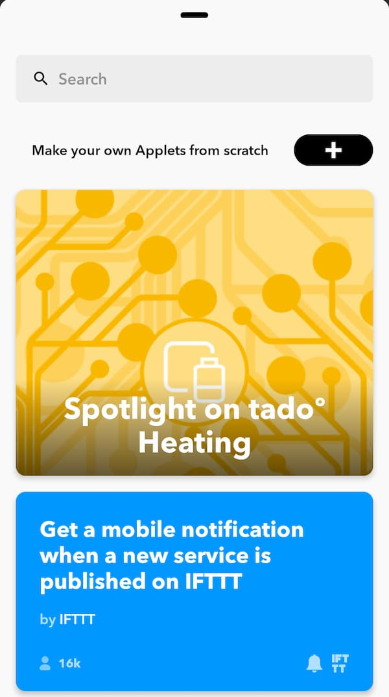

少し前に子どもが生まれました。  
控えめに言って天使ですね。  

妻の入院中は授乳をした時間、おしっこやうんちをした時間などを紙の表に記録していた（授乳表というらしい）のですが、退院後も記録しなければいけないようです。  

我が家ではSlackで記録することにしたので、その方法を書くことにしました。  

# 背景

次の2つの要件を満たすような（デジタルな）授乳表を欲していました。

- 夫婦どちらも記録でき、その記録が共有できること
- 記録が簡単であること

夫婦で共有できる授乳表アプリがあるらしいのですが、要件を満たすアプリを探すのは大変だったので、普段から使用しているSlackで記録を付けることにしました。

# やったこと

括弧内は既に実施していた設定です。本記事では詳細を割愛します。

- ([IFTTT]()とSlackの連携)
- (Slackのログ記録)  
    [Slack のログを自動で Google Spreadsheet に保存する - 詩と創作・思索のひろば](https://motemen.hatenablog.com/entry/2015/11/gas-slack-log-spreadsheet)を参考にログを保存しています。
- IFTTTでButton widgetを作成
- 授乳記録のパーサ作成

## IFTTTのButton widgetを作成

以下の4つのButton widgetレシピを作成しました。

- 授乳開始
- ミルク
- おしっこ
- うんち

現在(2019/12/14時点)では、レシピを公開できないので、夫婦それぞれのスマホで同じレシピを作りました。  

1. IFTTTアプリを開き、`Get more`をタップする  

2. `Make your own Applets from scratch`の右にある`+`をタップする  

3. `This`をタップし、`Button widget`を選ぶ  

`Select action`では`Button press`を選ぶ。  
(1個しかない)  

4. `That`をタップし、`Slack`を選ぶ  
`Select action`では`Post to channel`を選ぶ。  
(こちらも1個しかない)  

5. 値を変更する  
  
私は以下のように設定しました。  

フィールド | 値
:---:|:---:
Which channel? | `Channels`, `<投稿したいチャンネル名>`
Message | `{{OccurredAt}}:授乳開始`
Title | `授乳開始`
Title URL | `{{ShareURL}}`
Thumbnail URL | `{{LocationMapImageURL}}`

なお、`授乳開始`の部分を残りの`ミルク`などに変更し、計4つのレシピを作りました。  

6. ホーム画面に設置  
レシピ作成後、作成したレシピの歯車をタップすると手順5のような画面が表示される。  
`You may use this widget on your homescreen.`の右にある`Add`をタップすると、ホーム画面にウィジェットが設置できる。  

## 運用

4つのウィジェットをそれぞれのホーム画面に設置し、イベントが発生したときにタップしています。  

投稿されるメッセージは以下のような感じ。  

ミルクについては、飲んだ量も記録する必要があるので、タップ後に投稿されたメッセージのスレッドに手動で数値だけ投稿するようにしています。  

## 授乳記録のパーサ作成

Slackのログをパースして表の形に整形します。  

ウィジェットで投稿したメッセージを含むログファイルを引数に与えると、1日ごとに表を出力するパーサを作成しました。  

パーサは私の環境（ログの保存方法や出力形式など）しか想定していないため、汎用性が全くないです。  
そのため、需要があれば公開しようかなと考えています。  

ちなみに、私の環境ではGoogle Driveのスプレッドシートに、チャンネルごとにシートが分かれてログが保存されています。  
IFTTTのメッセージが保存されているチャンネルのシートをtsv形式で出力し、そのtsvファイルをパースしています。  

# おわりに

「簡単に記録を付けられて、かつ、その記録を共有できないか」という会話から、その場で思いつきで作ったのですが、今のところ大きな不満なく運用できています。  
授乳表の形へのパース部分は手動ですが、授乳表が必要なのは検診のときくらいなので、自動化は考えていません。  
~~自動化の方が大変そうですし。~~
