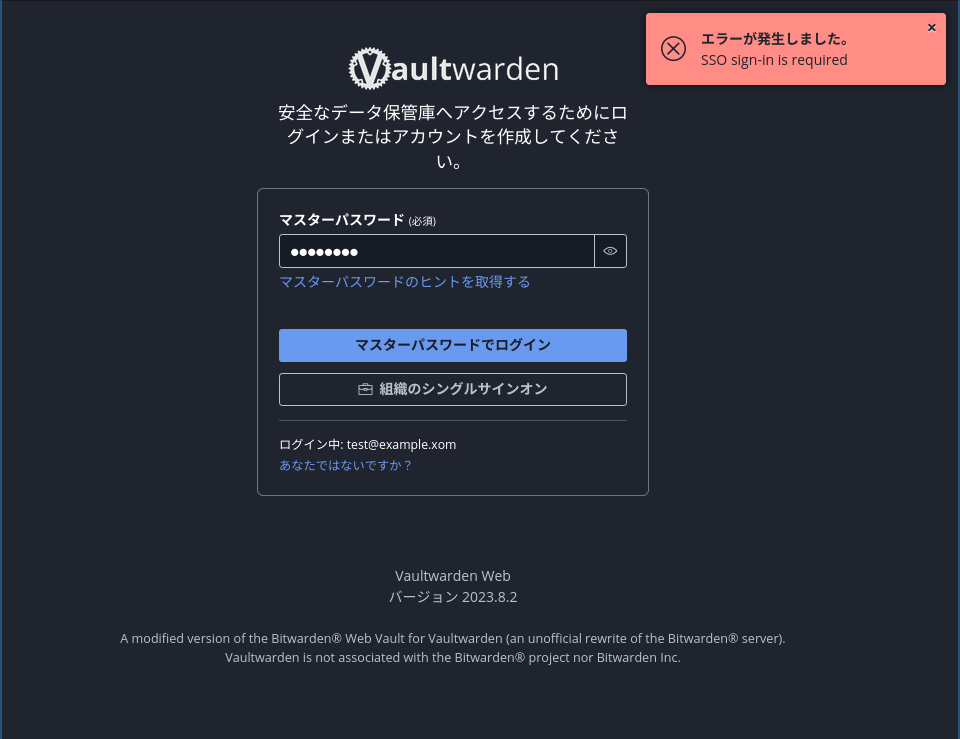
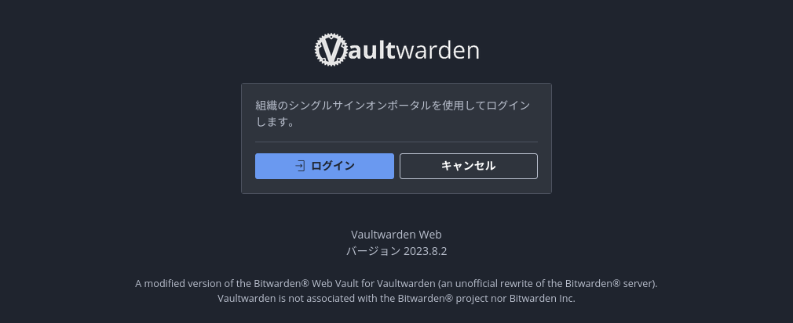
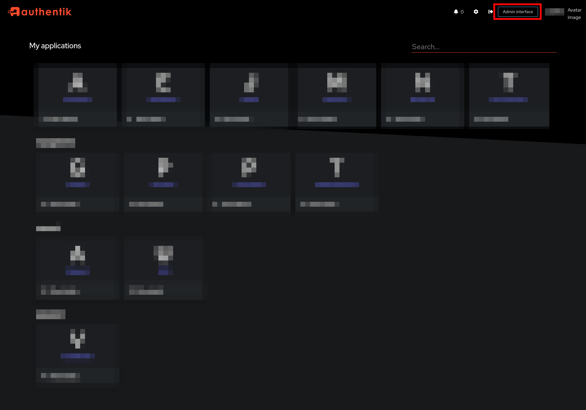
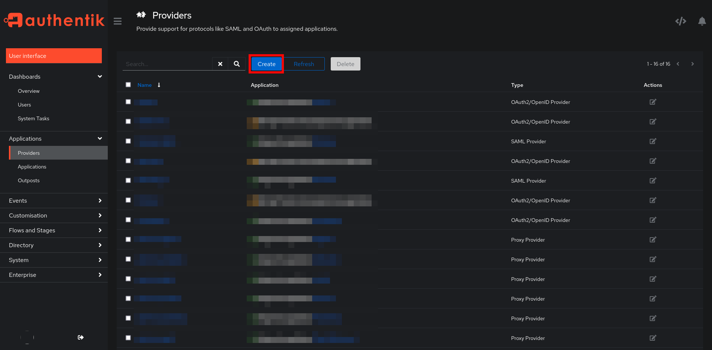
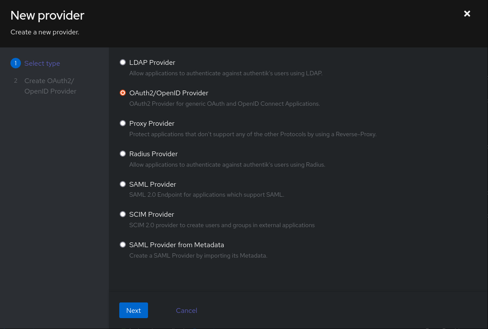
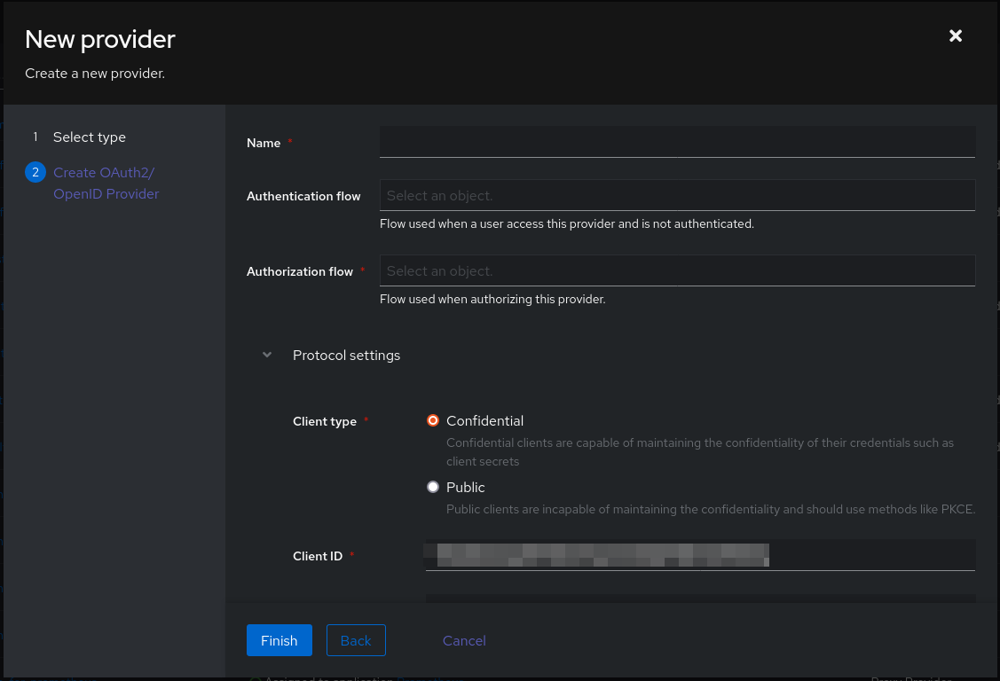
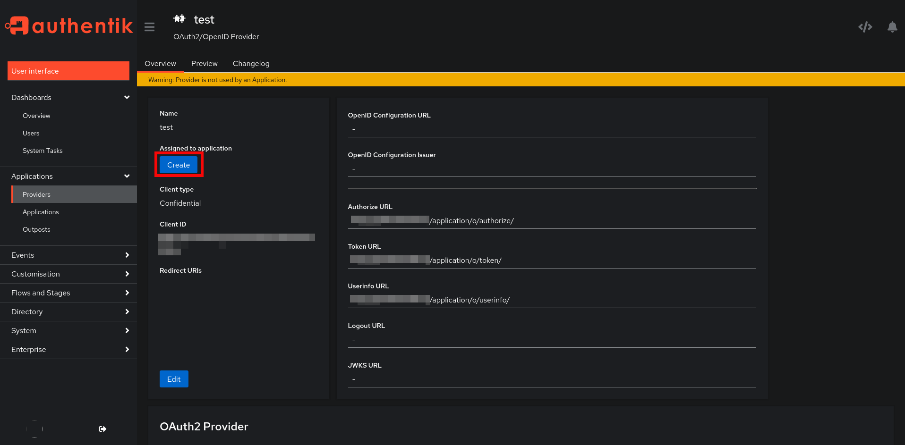
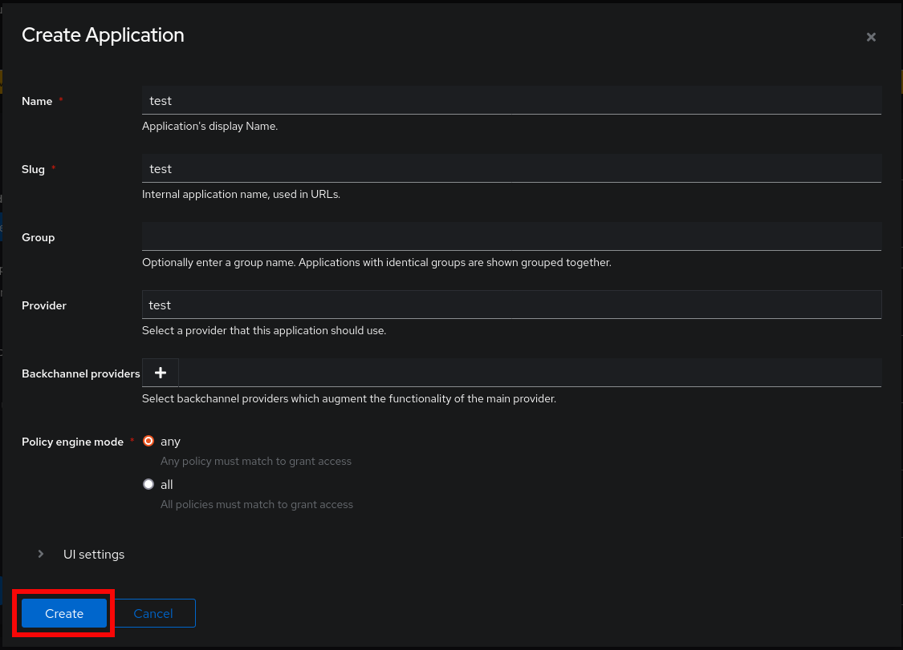

本エントリは、[調査メモ](https://github.com/bridge-y/scraps/issues/4)に SSO の設定を追加し、整理したもの。

## 要約

- Vaultwarden のプルリクエストにある SSO 実装を試してみた。
- Web ページと Android アプリから SSO でログインできた。

## 概要

- [Vaultwarden](https://github.com/dani-garcia/vaultwarden)は Bitwarden をセルフホストしやすいように Rust で実装した OSS。
- Bitwarden のすべての機能を実装しているわけではない。
  - 作者は SSO をはじめとする一部の機能は、コントリビュートがない限り実装されない、と述べている。
    - 出典: [Home · dani-garcia/vaultwarden Wiki](https://github.com/dani-garcia/vaultwarden/wiki) の Missing features より。
- SSO を望む声は一定数あり、issue やプルリクエストが見受けられる。
  - プルリクエストの例: [Yet another SSO PR using OpenID Connect by Timshel · Pull Request #3899 · dani-garcia/vaultwarden](https://github.com/dani-garcia/vaultwarden/pull/3899)
- 上記プルリクエストの実装をローカル環境で試してみる。
  - IdP には [authentik](https://github.com/goauthentik/authentik)を利用する。
    - バージョンは `2023.8.3`

## 試した SSO 実装について

リポジトリはこちら: [Timshel/vaultwarden: Unofficial Bitwarden compatible server written in Rust, formerly known as bitwarden_rs](https://github.com/Timshel/vaultwarden)

試したバージョン: コミット ID 09a399f8c5badb3200759622a543fcb106840404

2 つのフロントエンド実装がある。

<!-- textlint-disable -->

1. Bitwardenと同じ認証フロー（e-mail入力し画面遷移 → マスターパスワードを入力する画面でSSOのボタンが表示される。）

<!-- textlint-enable -->

2. デフォルトのログインページを `/sso` に変更

SSO 関連の環境変数は以下の通り[^1]。

[^1]: <https://github.com/Timshel/vaultwarden/blob/09a399f8c5badb3200759622a543fcb106840404/.env.template#L355> からコピペ

```bash
## SSO settings (OpenID Connect)
## Controls whether users can login using an OpenID Connect identity provider
# SSO_ENABLED=true
## Prevent users from logging in directly without going through SSO
# SSO_ONLY=false
## Auto accept organization invitation, if set to false you will need
##	- to let user log using email+Master password (SSO_ONLY=false)
##	- use a patched frontend to allow the invitation to be preserved across the sso redirection
# SSO_ACCEPTALL_INVITES=false
## Base URL of the OIDC server (auto-discovery is used)
# SSO_AUTHORITY=https://auth.example.com
## Set your Client ID and Client Key
# SSO_CLIENT_ID=11111
# SSO_CLIENT_SECRET=AAAAAAAAAAAAAAAAAAAAAAAA
## Optional SSO public key for JWT validation
# SSO_KEY_FILEPATH=%DATA_FOLDER%/sso_key.pub.pem
```

## 動作に関して

- SSO は期待通りに動作した。

  - Web ページ、Android アプリで検証。
  - authentik の設定は TODO：あとでかくを参照。

<!-- textlint-disable -->

- SSO を有効にしていても、マスターパスワードの設定は必要。

<!-- textlint-enable -->

- SSO（IdP 側）で 2FA を有効にしていても、VaultWarden 側で 2FA を設定できてしまう。

  - SSO で 2FA を有効、かつ、SSO を必須にしている場合は、管理者ページや環境変数で Vaultwarden の 2FA を無効にしてよさそう。
    - SSO 必須: `SSO_ONLY=true` とする。

- Dockerfile のビルドに時間がかかる。

  - 自分の環境では 30 分くらい。
    - CPU: Intel(R) Core(TM) i3-7100U CPU @ 2.40GHz
    - メモリ: 8GB x 2

- ログイン方法を SSO のみとするなら、フロントエンド実装 2 を利用するのがよさそう。
  - 個人的にはフロントエンド実装 2 のほうが好み。

### `SSO_ONLY=true` にした場合

<!-- textlint-disable -->

e-mail + マスターパスワードによる認証を試みると、下図のようなエラーメッセージが表示される。

<!-- textlint-enable -->



モバイルアプリでも同様のエラーメッセージが表示される。

### フロントエンド実装2

初期アクセス画面で下図のように SSO を促される。



<!-- textlint-disable -->

上記画面でキャンセルをクリックすると、通常の認証フロー（e-mail + マスターパスワード）となる。

<!-- textlint-enable -->

こちらの実装を利用するには、以下のように Dockerfile を書き換える。（README より）

```bash
sed -i 's/oidc_button_web_vault/oidc_overide_web_vault/' Dockerfile
```

## authentik の設定

authentik にログインし、Admin interface を表示する（下図の赤枠をクリックする）。



左上のハンバーガーメニュー → Applications → Providers → Create という順番でクリックする。



OAuth2/OpenID Provider を選択する。



OAuth2/OpenID Provider の各項目を設定する。  
(下図は項目の一部)



- `name`: 任意の名前
- `Authorization flow`: 選択肢から認可フローを選ぶ
- `Client type`: Confidential or Public. Confidential でよい
- `Client ID`: デフォルトの値でよい。Vaultwarden の設定(`SSO_CLIENT_ID`)で使う
- `Client Secret`: Vaultwarden の設定(`SSO_CLIENT_SECRET`)で使う
- `Signing Certificate`: authentik Self-signed Certificate を選ぶ

Provider 一覧にある作成した Provider → Assigned to application の Create の順番でクリックする。



Application の各項目を設定する。



- `Name`: 任意の値（例: vaultwarden）
- `Slug`: 任意の値（例: vaultwarden）
- `Provider`: さきほど作成した Provider を選択する

Application の作成後、作成した Provider を再度表示すると、OpenID Configuration Issuer に値が設定される。 この値は、Vaultwarden の設定(`SSO_AUTHORITY`)に使用する。

## おわりに

試した範囲では問題がなく、とてもよい体験だった。  
現在は Vaultwarden の公式イメージを利用しているが、今回試した SSO 実装のものに置き換えたいとさえ思っている。

本家にマージされないかな。
