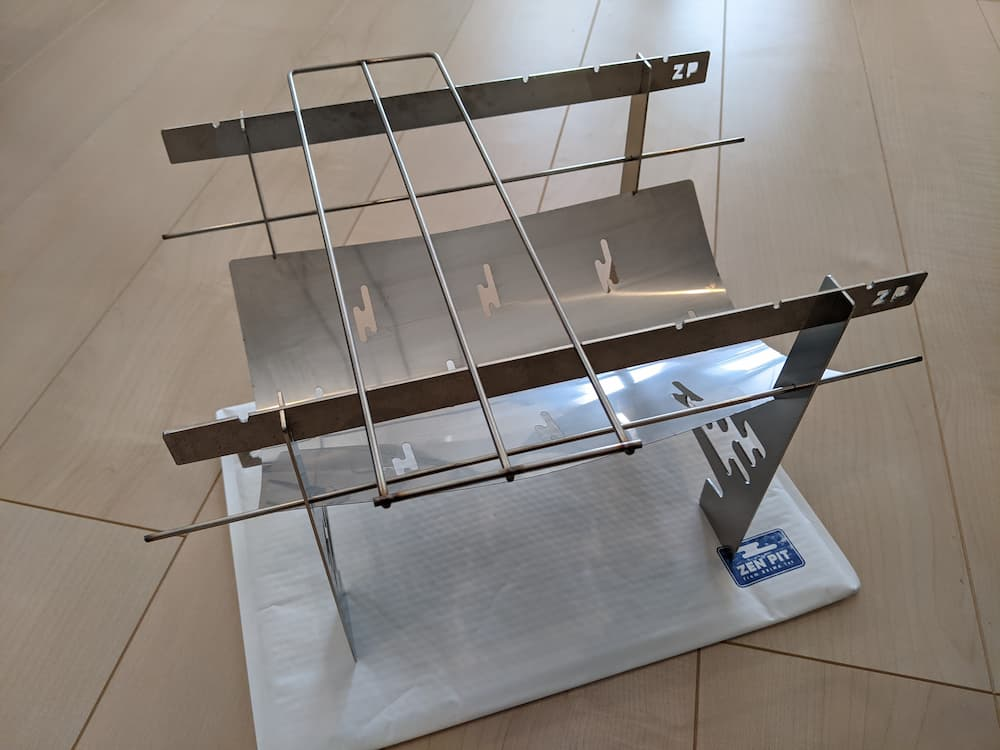
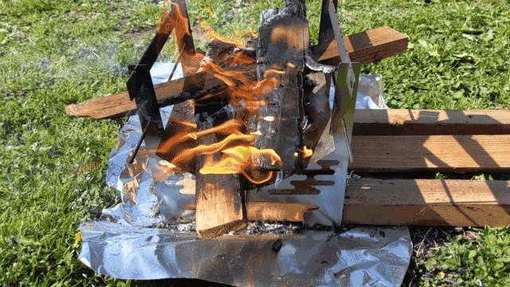

趣味の一つがキャンプです。  
先月グランピングへ行って、いい感じにキャンプ欲が高まっていたので、新しい焚き火台を買いました。



[ZEN PIT](https://zenpit.fun/)という焚き火台です。
コンパクトで軽量、それなのに薪をそのまま置くこともできます。

早速ZEN PITで焚き火をするためにデイキャンプへ行ってきました。

火床が湾曲しているので、薪を組むのには少しコツがいるなと思いました。
今回初使用だったこともあり、空気が通るように薪を組むことができず、なかなか火が育ちませんでした。
薪の組み方に拘らず、小さめの薪を多めに作ってさっさと焚べればよかったかな。
火が十分育てば、空気の通りが良いので組み方を気にせず薪をおいてもよく燃えました。

写真では薪を立てて組むために火床の谷に橋を架けるように薪を置いていますが、このまま放置すると中央で折れて焚き火台の外に落ちる可能性が高いためご注意ください。

今回のキャンプでは焚き火しかしませんでしたが、次は調理に挑戦したいです。
ZEN PITでピザを焼くこともできるんですよ[^1]。最高ですね。

[^1]: [ZENPIT オーブン調理「ピザ」 - YouTube](https://www.youtube.com/watch?v=KSu9aREerCI)


